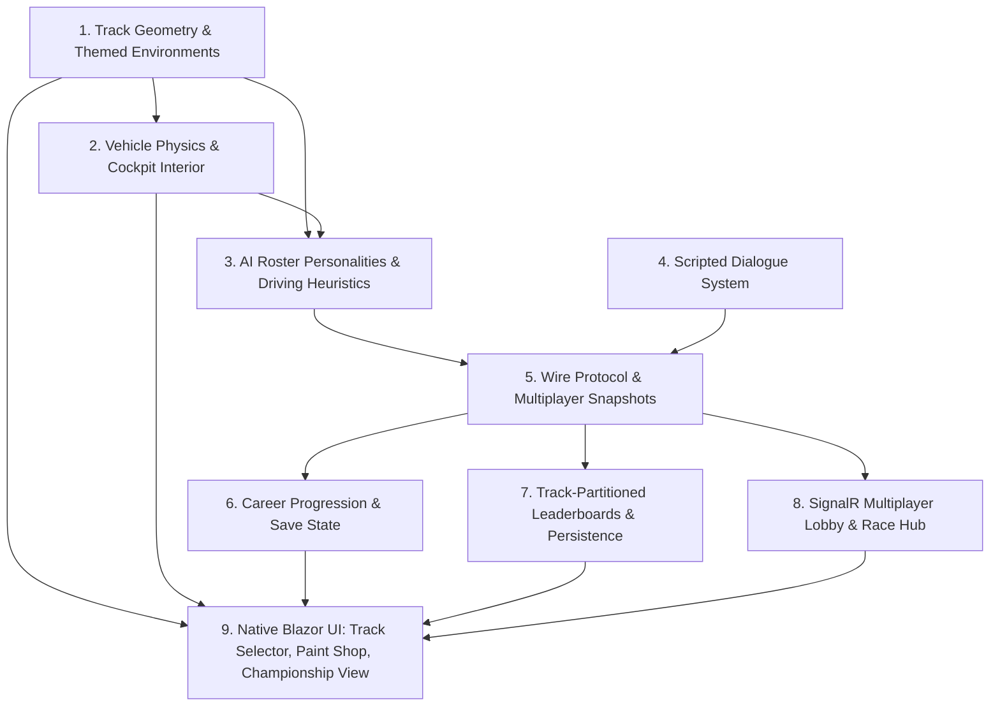

# Capability Map — PoCabinet (Cockpit-View Political Satire Racer)

PoCabinet ships as 9 cohesive, testable modules inside the PoMiniGames framework. Arrows denote build-order dependencies (a module is implemented only after its prerequisites exist and pass tests).



---

## Module Directory

| # | Module | Location | Primary Responsibilities | Test Surface | Depends On |
|---|--------|----------|--------------------------|--------------|------------|
| **1** | **Track Geometry & Themed Environments** | `src/PoMiniGames.API/Features/PoCabinet/PoCabinetTrackRegistry.cs`, `PoCabinetTrackData.cs`; `src/PoMiniGames.Client/wwwroot/js/pocabinet/scene.js` | 3 themed tracks (Capitol Speedway asphalt, Mar-a-Lago GP beachside, Press Briefing 500 podium stadium) as server spline + client three.js scene base. Per-track atmospheric lighting, sky color, fog density. Three.js material setup following PoEcosystem Lambert pattern (`normal_fragment_begin` for normal-dependent shader code). | Hermetic C# unit tests: closed-loop splines, checkpoint ordering, wall normal consistency. Visual audit (browser) for theme correctness, no GL state leak on track switch. | — |
| **2** | **Vehicle Physics & Cockpit Interior** | `src/PoMiniGames.API/Features/PoCabinet/PoCabinetSim.cs`; `src/PoMiniGames.Client/wwwroot/js/pocabinet/cockpit.js` | Server-authoritative car physics: throttle, brake, steering, grip, speed clamping, wall collisions, surface zones (asphalt, sand, gravel). Cockpit interior (steering wheel, hood, dashboard, RPM/speed gauges, rear-view mirror) rendered as three.js primitives. Camera tied to car heading with damping. | Hermetic C# unit tests: speed clamping, grip degradation, wall collision resolution, lap counting. Three.js scene audit: cockpit assets mount/unmount cleanly, no leaks on car wipe. | 1 |
| **3** | **AI Roster Personalities & Driving Heuristics** | `src/PoMiniGames.API/Features/PoCabinet/PoCabinetAiDriver.cs`, `PoCabinetSim.cs` | 4 named officials (Sean S., Steve B., Bill B., Mike P.) with distinct personality parameters: racing line offset, braking aggression, collision tolerance, drafting affinity. Look-ahead steering with marshal rescue on stall. Each official's driving produces visibly different lap patterns. | Hermetic C# unit tests: each personality completes laps without stall, steering variance between officials, marshal rescue timer. | 1, 2 |
| **4** | **Scripted Dialogue System** | `src/PoMiniGames.API/Features/PoCabinet/PoCabinetDialogue.cs`; `src/PoMiniGames.Client/wwwroot/js/pocabinet/dialogue.js` | Per-official pools of pre-race speeches (~8 each), mid-race barks (~12 each), post-race quips (~6 each). Triggered by race events (pre-race countdown, lap transitions, position changes, finish). Hand-authored content, no AI generation. | Unit tests: dialogue selection is deterministic by seed, pool exhaustion falls back gracefully, content scan rejects slurs/hate speech per Microsoft content policies. | — |
| **5** | **Wire Protocol & Multiplayer Snapshots** | `src/PoMiniGames.Shared/Games/PoCabinetShared.cs` | DTOs for race state (cars, positions, lap counts, dialogue cues), join/leave events, championship progression, leaderboard rows. Snapshot shape sized for ≤ 2 KB per tick at 8 cars. | Unit tests: JSON wire size, enum string compatibility, snapshot immutability. | 3, 4 |
| **6** | **Career Progression & Save State** | `src/PoMiniGames.Client/Games/PoCabinet/PoCabinetCareerState.cs`; `src/PoMiniGames.API/Features/PoCabinet/PoCabinetCareerEndpoints.cs` | Linear 3-race championship state machine: Capitol Speedway → Mar-a-Lago GP → Press Briefing 500. Top-3 finish advances; winning the final unlocks the gold livery + trophy. Persists to `localStorage` (player device) with optional server-side sync via `/api/pocabinet/career` endpoint for cross-device resume. | Unit tests: state transitions, advance gating, trophy unlock, localStorage round-trip. E2E-API: career endpoint contract. | 5 |
| **7** | **Track-Partitioned Leaderboards & Persistence** | `src/PoMiniGames.Domain/Models/PoCabinetHighScore.cs`; `src/PoMiniGames.Infrastructure/Services/StorageService.cs` (extension); `src/PoMiniGames.API/Features/PoCabinet/PoCabinetScoreEndpoints.cs` | Azure Table Storage `PoCabinetScores` partitioned by `TrackId`. REST `/api/pocabinet/scores?track={trackId}` (anonymous reads, authed writes under `pocabinet` rate-limit policy). Best-lap ranking per track. | Integration tests (Azurite): row partitioning, ETag-update on overwrite, rate-limit cooldown. E2E-API: query validation + 401/200 status contract. | 5 |
| **8** | **SignalR Multiplayer Lobby & Race Hub** | `src/PoMiniGames.API/Features/PoCabinet/PoCabinetLobbyHub.cs`, `PoCabinetRaceHub.cs`, `PoCabinetLobbyService.cs`, `PoCabinetRaceRegistry.cs` | Lobby creation with 8-char join code (PoRacer `PoRacerRaceRegistry` pattern). Up to 8 players per race, claim-derived seats. Snapshot at 30 Hz deterministic tick (PoRacer pattern). Lobby times out after 5 minutes idle. Demo Elo ladder via `PoCabinetElo` table, increment-on-finish (PoBrawl pattern). | Unit tests: lobby state machine, seat binding, Elo increment math. E2E-API: lobby hub negotiate contract. | 5 |
| **9** | **Native Blazor UI** | `src/PoMiniGames.Client/Games/PoCabinet/{PoCabinetPage.razor, PoCabinetTrackSelector.razor, PoCabinetPaintShop.razor, PoCabinetChampionshipView.razor, PoCabinetLobby.razor}` | Track selector (3 cards with difficulty, length, preview), paint shop (4 liveries × 4 colors, persisted to `localStorage`), championship tracker (current stage, trophy status, gold livery unlock), multiplayer lobby (join code entry, seat list), race HUD (speed, RPM, gear, lap, position, dialogue bubbles). Native Blazor, semantic CSS tokens, accessibility (WCAG AA, full keyboard + touch). No Radzen. | Component unit tests: state binding, accessibility, keyboard nav. E2E-UI: route renders, race starts, lobby accepts join code. | 1, 2, 6, 7, 8 |

---

## Build & Execution Sequence

```
Module 1 (Track Geometry & Theming)
   │
   ├──► Module 2 (Vehicle Physics & Cockpit Interior)
   │       │
   │       └──► Module 3 (AI Roster Personalities)
   │               │
   │               ├──► Module 5 (Wire Protocol & Snapshots) ◄── Module 4 (Dialogue System)
   │               │
   │               ├──► Module 6 (Career Progression)
   │               ├──► Module 7 (Leaderboards)
   │               └──► Module 8 (Multiplayer Lobby)
   │                       │
   │                       └──► Module 9 (Native Blazor UI)
```

Modules 4 (Dialogue) and 6/7/8 are independent of 1/2/3 in code terms but ship after 5 (Wire Protocol) so the dialogue events and race state flow through the same wire. Build order in `tasks/todo.md` reflects this.

---

## Architectural Guardrails & Contracts

1. **Server-Authoritative Simulation**: All car positions, speed, wall collisions, surface friction, lap counts, race finishes are computed strictly on the server in `PoCabinetSim.cs`. The client is a thin renderer receiving 30 Hz snapshots and emitting intent (steer/throttle/brake) inputs.

2. **No AI Foundry, No LLM Token Spend**: All dialogue is hand-authored in `PoCabinetDialogue.cs`. The framework's AI infrastructure (`/api/infer`, Azure OpenAI deployments) is NOT used by PoCabinet — `PoCabinet:Features:UseMockAI` does not apply (no AI boundary exists).

3. **No Real Likenesses**: Roster art is procedural / static stylized vector portraits in the flat-shaded spirit of the PoEcosystem palette. Azure AI image generation is OUT (content-filter risk + cost); first-name + last-initial naming (`Sean S.`, etc.) carries the satirical reference without claiming to depict a specific real person.

4. **Test Tier Ceilings** (HARD, per [`CLAUDE.md`](CLAUDE.md)):
   - Unit ≤ 100 (currently AT cap; PoCabinet requires upfront consolidation of existing tests before any additions).
   - Integration ≤ 50 (47/50; ~3 slots free; PoCabinet target ≤ 2).
   - E2E-API ≤ 25 (19/25; ~6 slots free; PoCabinet target ≤ 5).
   - E2E-UI ≤ 25 (17/25; ~8 slots free; PoCabinet target ≤ 3).
   - PoCabinet ceiling trip on any tier → consolidate, never raise.

5. **Trim Audit Safety**: three.js scene uses pre-allocated `BufferGeometry` and shared materials — no reflection-based dispatch in WASM. Trim analyzer gate is run after Module 9 ships.

6. **Bundle Budget**: PoCabinet adds three.js scene (`wwwroot/js/pocabinet/`) + cockpit primitives + 3 themed tracks. Estimated +1.5 MB raw, post-trim +800 KB. Within the 25 MB `_framework` budget.

7. **Native Blazor, Zero Radzen**: All UI uses native Blazor + CSS design tokens (`--color-surface`, `--color-primary`, etc.). Per [`CLAUDE.md`](CLAUDE.md#L113), Radzen.Blazor is rejected for bundle size.

8. **Anti-Cheat**: Race ticks reconcile on the server; client cannot inject final-position claims. Lobby `/negotiate` is anonymous (SignalR hub at own root); writes require antiforgery token per the framework pattern.

9. **Anti-Forgery Note**: All `POST/PUT/DELETE /api/pocabinet/*` requires the synchroniser token (framework `AntiforgeryExtensions`). The open antiforgery 403 bug (per `/memories/repo/local-dev-notes.md`, found 2026-09-13) affects authed writes across ALL games — this is a framework bug, not PoCabinet's; PoCabinet integration tests must target the workaround path until the framework fix ships.