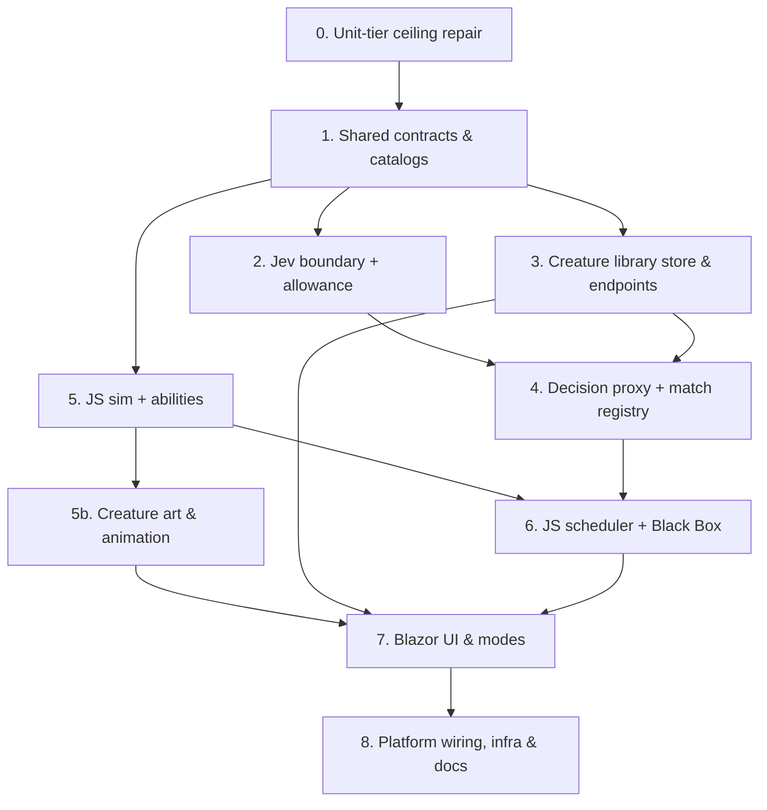

# Capability Map — PoJevArena (10v10 Jev-Driven Creature Battle)

PoJevArena ships as 9 modules (1–8 plus 5b, creature art) and one prerequisite repair. An arrow means the module at its tail must exist and pass
its tests before the module at its head is built. The PoCabinet map is in git history
(`git show 438800e7:CAPABILITY-MAP.md`).

---

## Module Directory

| # | Module | Location | Responsibilities | Test surface | Depends on |
|---|---|---|---|---|---|
| **0** | Unit-tier ceiling repair | `tests/PoMiniGames.Unit/**` | Bring Unit from 104 back to ≤ 96 methods by folding related facts into theories, with no assertions dropped. This fixes today's red CI gate and makes room for Module 1–4 tests | `scripts/test-ceilings.ps1`; every folded test still passes | — |
| **1** | Shared contracts & catalogs | `src/PoMiniGames.Shared/Games/PoJevArenaShared.cs` | **Ability registry** (the extension point: id, slot, cost, Jev option key and criterion, parameters); the three personality catalogs; base tactical options and target foci; stat bounds; the build-budget function; the five presets; wire DTOs (creature, unit decision request/result, match register/result, status); a source-generated JSON context | Covered by Module 2/3 theories (validation, budget, registry integrity, prompt building) | 0 |
| **2** | Jev boundary + daily allowance | `src/PoMiniGames.API/Features/PoJevArena/Jev/*`, `JevPromptBuilder.cs`, `JevCallAllowance.cs` | `JevOptions` (`PoMiniGames:Jev`); a named `HttpClient` (1.5 s timeout, no retries); a process-wide 16-permit `ConcurrencyLimiter`; the prompt builder (validated structured input → state string + per-attack-type question set); response mapping; the durable 20k/day per-identity call cap over the ledger-store pattern (table `PoJevArenaCallLedger`); a stub client honoured only in the `Test` environment | Unit: prompt builder theory, response mapping theory, allowance theory. Integration: allowance survives a restart | 1 |
| **3** | Creature library | `src/PoMiniGames.API/Features/PoJevArena/CreatureLibraryStore.cs`, `PoJevArenaEndpoints.cs` (creature routes) | Table `PoJevArenaCreatures` (partition `lib`); create/edit/delete for the owner only; 25-per-owner cap; names through `DisplayNameSanitizer`; list with sort (new / used / win rate) and search; counter increments via `TableConcurrency` | Unit: validation theory. Integration: round-trip + commuting increments. E2E-API: 401/403 contract rows | 1 |
| **4** | Decision proxy + match registry | `ArenaMatchRegistry.cs`, `PoJevArenaEndpoints.cs` (status, matches, decisions, result) | Register a match (rosters frozen, seed issued); fan a 1–8 unit batch out to Jev in parallel through the limiter; per-unit success or failure; a whole-batch 429 when over allowance; per-match `usage.cost` sum; one-shot owner-only result gated on plausibility (≥ 10 s, ≥ 80% of the claimed time elapsed, ≥ max(40, 4 × duration) decisions), released again if the stats write fails; applies deployed/W/L/D increments | Unit: registry/allowance theory. E2E-API: contract rows. E2E-UI: exercised end-to-end with the stub | 2, 3 |
| **5** | JS sim + abilities | `src/PoMiniGames.Client/wwwroot/js/pojevarena/{sim,abilities}.js` | Pure 60 Hz physics (§4.3 of SPEC): damping, elastic circle collisions with brace mass, walls, **melee for every creature** (wind-up, lunge, knockback, cooldown), one damage pipeline (invulnerable → shell → brace arc → poison), registry-driven ability handlers (spit, boulder, mend, brace, shell, dash), intent steering, match end and 3:00 HP% rule | Scratch `node` harness (not a tier): a scripted-decision match ends, an ability-less creature kills by melee, every ability fires, no NaN over 10,800 ticks | 1 |
| **5b** | Creature art & animation | `wwwroot/js/pojevarena/{creatures,fx,render}.js` | Procedural silhouettes (body from mass and speed, features from abilities, face and mannerism from temperament, seeded pattern), cached per-team body bitmaps, an animation state machine (idle, move, wind-up, strike, ability, hit, shell, dash, panic, low-HP, death), per-ability fx, particles (cap 400), popups, decals, intent overlay, colour-independent team markers, reduced-motion path, a Factory preview loop | Playwright screenshot sheet (one row per preset per team per pose), a grey-scale identification check, render ≤ 8 ms p95 | 5 |
| **6** | JS scheduler + Black Box | `wwwroot/js/pojevarena/{scheduler,blackbox,index}.js` | A 250 ms slot scheduler (unit slot = index mod 4, no overlapping in-flight requests); candidate computation; a .NET round trip via `DecideAsync`; hold-last-intent-on-failure with a stale timer; a typed-array frame recorder and decision event log; scrub/play/step/speed; pause when the tab is hidden; `window.PoJevArena` mount/deploy/stop/unmount lifecycle that releases listeners, the rAF loop and timers | Scratch `node` harness for the scheduler cadence (≤ 20 calls/s). E2E-UI: scrubber drives the canvas and inspector | 4, 5 |
| **7** | Blazor UI & modes | `src/PoMiniGames.Client/Games/PoJevArena/*` | Page with `@page "/pojevarena"` and `"/pojevarena/{ModeSegment}"`, `GameShell` + `GameIntro`; Factory, Library (`<Virtualize>`), Roster trays (2P hot-seat hiding and hand-off), Jev Inspector, Black Box scrubber, status chip, banners from §10 of SPEC; roster `localStorage`; typed API client with source-gen JSON; demo loop | E2E-UI: Journey 1 with the stub; all three routes render | 3, 6 |
| **8** | Platform wiring, infra & docs | `GameCatalog.cs`, `GameKey.cs` (client + Domain), `MainLayout.razor`, `engineLoader.js`, `StorageInitializer.cs`, `EndpointRouteExtensions.cs`, `GameServicesExtensions.cs`, `RateLimitingExtensions.cs`, `tests/Shared/TestBudgetGuard.cs`, `infra/kv-secrets.bicep`, `infra/main.bicep`, `infra/main.parameters.json`, `appsettings*.json`, `CLAUDE.md`, `README.md` | Home-page card; route prefixes (plus PoCabinet's missing prefix, per Open Question 2); engine registry; startup tables; rate policies `pojevarena` (30/min) and `pojevarena-decide` (300/min); the one `TestBudgetGuard` edit; the restored conditional Key Vault secret; the docs update | Build, trim audit, bundle budget, host boots with `/health` 200 | 7 (registration pieces land with the module that needs them) |

---

## Architectural Guardrails & Contracts

1. **Jev is required, never simulated.** Outside the `Test` environment there is no decision source other than
   Jev. A failed call means the unit holds its last intent. The stub exists only behind
   `TestBudgetGuard` + `IsEnvironment("Test")`.
2. **The proxy is not a pass-through.** The client sends numbers and catalog ids. The server validates them and writes
   every word Jev sees. The API key never leaves the server.
3. **Cost is bounded at three layers**: 1 Hz per unit (about 20 calls/s per match), a durable 20k calls per identity
   per day, and a 16-permit process-wide concurrency limiter in front of an upstream whose rate limit is unpublished.
4. **The browser owns the simulation; the server owns trust.** Physics, rendering and the Black Box are client-side and
   never uploaded. The server only holds what must not be forged cheaply: the allowance, the library, and the
   result gate (owner, one-shot, plausible duration and paid decisions; the winner is the client's word, so
   forging a result costs as much as playing one).
5. **Counters are increments under an ETag**, never read-modify-write absolutes, the same as the PoBrawl demo Elo board
   and the AI token ledger.
6. **Storage failure degrades.** Library reads go empty, writes fail visibly, and there is no in-memory fallback.
   This follows the 2026-09-12 decision recorded in `CLAUDE.md`.
7. **Test tier ceilings are hard.** Unit is repaired first (Module 0). E2E-API is full, so PoJevArena extends an
   existing contract theory rather than adding a method.
8. **Trim-safe.** All client JSON goes through source-generated contexts. There are no new packages, and the engine is
   plain JS loaded on demand, so the `_framework` bundle grows only by the Razor components.
9. **Native Blazor, no Radzen.** Colours come from `app.css` tokens. Team colours are scheme-invariant canvas tokens.
10. **Abilities are data plus one handler plus one visual.** The C# registry is the single source for validation,
    cost and the Jev option; JS keys handlers and visuals by the same id. No code outside those three places may list
    abilities by name, which is how "room for other abilities" stays true.
11. **Melee is universal.** Every creature can `melee_charge`, and abilities only add options. Removing the offense
    ability from a creature never leaves it unable to fight.
