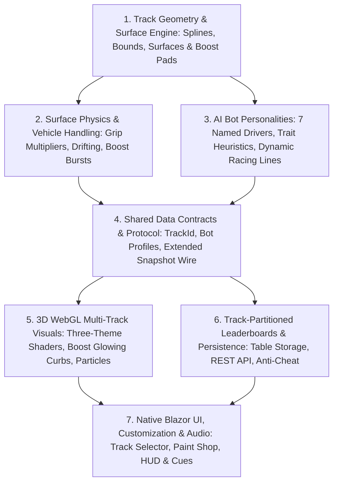

# Capability Map — PoRacer Overhaul (Multi-Track, AI Personalities & Physics)

PoRacer expands into 7 cohesive, testable modules. Arrows denote build-order dependencies (a module is implemented only after its prerequisites exist and pass tests).



---

## Module Directory

| # | Module | Location | Primary Responsibilities | Test Surface | Depends On |
|---|--------|----------|--------------------------|--------------|------------|
| **1** | **Track Geometry & Surface Engine** | `src/PoMiniGames.API/Features/PoRacer/PoRacerTrackRegistry.cs`, `PoRacerTrackData.cs` | Mathematical definition of 3 closed Catmull-Rom tracks (Circuit, Neon Skyline, Desert Rally), centerline resampling, wall normal generation, surface zones (asphalt, sand/dirt), and boost pad bounding segments. | Hermetic C# unit tests: closed loop continuity, normal vector consistency, wall generation, bounding box checks. | — |
| **2** | **Surface Physics & Vehicle Handling** | `src/PoMiniGames.API/Features/PoRacer/PoRacerSim.cs` | Server-authoritative car physics with surface friction coefficients (Tarmac = 1.0x, Sand/Off-road = 0.7x grip, slip angle calculation), boost pad trigger detection (+35% acceleration for 1.8s), drift mechanics. | Hermetic C# unit tests: speed clamping, surface grip degradation on sand, boost pad entry/exit timers, wall collision resolution. | 1 |
| **3** | **AI Bot Personalities & Heuristics** | `src/PoMiniGames.API/Features/PoRacer/PoRacerAiDriver.cs`, `PoRacerSim.cs` | 7 distinct bot personalities (e.g. *Apex Predator*, *Draft Hunter*, *Aggressive Bumper*, *Ghost Line*, *Speed Demon*, *Cautious Cruiser*, *Slipstreamer*) with custom racing line offsets, aggression ratings, braking points, and overtake logic. | Hermetic C# unit tests: lap completion guarantee, personality steering variance, stuck marshal rescue. | 1 |
| **4** | **Shared Data Contracts & Wire Protocol** | `src/PoMiniGames.Shared/Games/PoRacerShared.cs` | Track metadata DTOs (`TrackId`, surface properties, boost pads), car visual customization records (palette/livery IDs), extended `PoRacerRaceSnapshot` and `PoRacerStaticWorld` wire contracts. | Serialization unit tests: JSON wire size verification (< 2 KB per snapshot), enum string compatibility. | 2, 3 |
| **5** | **3D WebGL Multi-Track Visuals** | `src/PoMiniGames.Client/wwwroot/js/poracerGl.js` | WebGL canvas rendering for 3 environmental themes: classic Grand Prix curbs, Neon Skyline glowing cyber barriers & asphalt reflections, and Desert Rally dust storms & dunes. Boost pad animated texture shaders and tire skid/dust particle emitters. | Visual audit in browser, manual checklist, zero GL state leak between track switches. | 4 |
| **6** | **Track-Partitioned Leaderboards & Persistence** | `src/PoMiniGames.API/Features/PoRacer/PoRacerScoreEndpoints.cs`, `src/PoMiniGames.Infrastructure/Services/StorageService.cs` | Azure Table Storage partitioning per `TrackId` (`PoRacerScores_{TrackId}` or composite row keys), REST `/poracer/scores?track={trackId}` validation, rate limits, server-side auth identity enforcement. | Integration tests (Azurite Table Storage) & Unit tests for input validation within ceilings. | 4 |
| **7** | **Native Blazor UI, Customization & Audio** | `src/PoMiniGames.Client/Games/PoRacer/{PoRacerPage.razor, PoRacerTrackSelector.razor, PoRacerPaintShop.razor}` | Track selection cards with preview stats, car paint shop (persisted in `localStorage`), enhanced HUD (boost meter, surface indicator, track minimap, split delta), procedural Web Audio cues for boost burst and surface transitions. | Component unit tests, accessibility compliance (WCAG AA, no CLS), bundle size verification (~1.2 MB limit). | 5, 6 |

---

## Build & Execution Sequence

```
Module 1 (Track Geometry & Surfaces)
   │
   ├──► Module 2 (Surface Physics & Handling)
   └──► Module 3 (AI Bot Personalities)
           │
           └──► Module 4 (Shared Data Contracts & Protocol)
                   │
                   ├──► Module 5 (3D WebGL Multi-Track Visuals)
                   └──► Module 6 (Track-Partitioned Leaderboards)
                           │
                           └──► Module 7 (Native Blazor UI, Customization & Audio)
```

---

## Architectural Guardrails & Contracts

1. **No External Component Library Overhead**:
   Per [`CLAUDE.md#L113`](CLAUDE.md#L113), no `Radzen.Blazor` or heavy UI dependencies are permitted. All track selection modals, car color pickers, and leaderboard tabs are crafted using native Blazor, CSS design tokens from `wwwroot/css/app.css`, and scoped CSS.
2. **Server-Authoritative Simulation**:
   All car positions, speed, wall collisions, surface friction, boost timers, lap counts, and race finishes are computed strictly on the server in `PoRacerSim.cs`. The client is a thin renderer receiving 20 Hz snapshots.
3. **Deterministic AI & Zero AI Foundry Spend**:
   Bot behaviors are implemented via CLR heuristics. No external LLMs, AI Foundry tokens, or third-party APIs are called during races, preserving 100% free offline-capable execution and zero latency.
4. **Test Tier Ceilings**:
   Solution test ceilings (Unit ≤ 100, Integration ≤ 50, E2E-API ≤ 25, E2E-UI ≤ 25) must not be exceeded. New unit tests will be tightly scoped to verify new track spline math, physics calculations, and leaderboard partition logic without test bloat.
