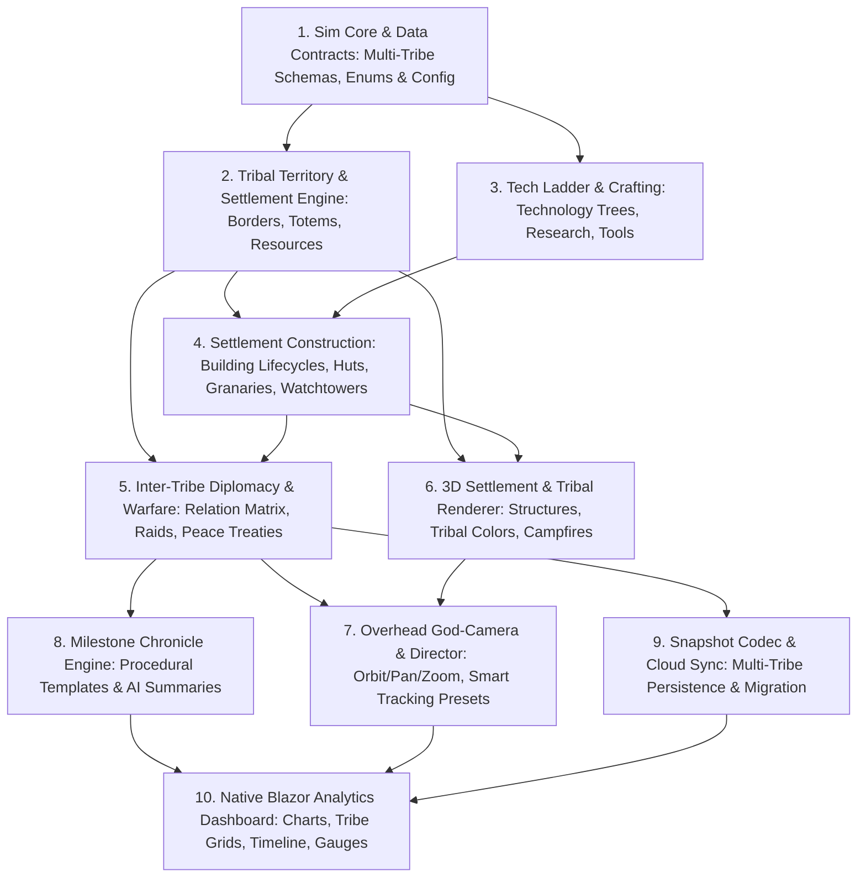

# Capability Map — PoEcosystem Civilization & Multi-Tribe Evolution

PoEcosystem expands into 10 cohesive, testable modules. Arrows denote build-order dependencies (a module is implemented only after its prerequisites exist and pass tests).



---

## Module Directory

| # | Module | Location | Primary Responsibilities | Test Surface | Depends On |
|---|--------|----------|--------------------------|--------------|------------|
| **1** | **Multi-Tribe Data Contracts** | `wwwroot/js/poecosystem/sim/tribe/contracts.js`, `src/PoMiniGames.Shared/Games/PoEcosystemShared.cs` | Tribe identities (names, banners, hues), diplomacy enums (`Neutral`, `Allied`, `Rival`, `War`), tech tier definitions, and building type schemas. | Vitest: schema validation, default tribe initialization, color-contrast checks; C# unit tests for DTO serialisation. | — |
| **2** | **Territory & Resource Engine** | `wwwroot/js/poecosystem/sim/tribe/territory.js`, `sim/tribe/tribeStore.js` | Dynamic territory influence mapping, voronoi/radius boundaries, totem placements, resource claim zones (wood, stone, berries). | Vitest: territory boundary math, overlapping claims resolution, totem placement validation on walkable terrain. | 1 |
| **3** | **Tech Ladder & Crafting** | `wwwroot/js/poecosystem/sim/tribe/techLadder.js` | 4-tier technology tree (Primitive Foraging &rarr; Toolcraft &rarr; Agrarian &rarr; Fortification), research rate based on elder/population ratios, crafting unlocks. | Vitest: tech requirement graph, research point accumulation, unlock triggers, bonus multipliers. | 1 |
| **4** | **Settlement Construction** | `wwwroot/js/poecosystem/sim/tribe/construction.js` | Site selection heuristics, resource delivery (wood/stone), building construction states (Unbuilt &rarr; UnderConstruction &rarr; Complete &rarr; Damaged), building maintenance. | Vitest: site selection avoids water/steep slopes, material cost deduction, build progress ticks, capacity calculations. | 2, 3 |
| **5** | **Diplomacy & Combat State Machine** | `wwwroot/js/poecosystem/sim/tribe/diplomacy.js`, `sim/behavior/combat.js` | Inter-tribe relation matrix, friction triggers (border encroachment, scarcity, raids), skirmish squad formation, casualty thresholds, peace treaty conditions. | Vitest: relation transitions, war declaration conditions, skirmish engagement distance, peace negotiation cooldowns. | 2, 4 |
| **6** | **3D Settlement & Tribal Renderer** | `wwwroot/js/poecosystem/render/settlementMesh.js`, `render/creatureMeshes.js` | Procedural Three.js structures (thatched huts, stone granaries, palisades, campfires with point lights), distinct tribal banner accents on human meshes. | WebGL rendering (manual checklist + E2E-UI smoke); instanced geometry count verification. | 2, 4 |
| **7** | **Overhead God-Camera & Director** | `wwwroot/js/poecosystem/render/camera.js`, `render/director.js` | Overhead orbit/pan/zoom controls, smooth interpolation (slerp/lerp), smart focus presets (Whole Island, Tech Leader Tribe, Active Conflict / Battle). | Vitest: camera target interpolation bounds, focus target selection algorithm; UI interaction tests. | 5, 6 |
| **8** | **Milestone Chronicle Engine** | `wwwroot/js/poecosystem/sim/tribe/chronicle.js`, `src/PoMiniGames.API/Features/PoEcosystem/EcosystemChronicleService.cs` | Formats historical chronicle entries for pivotal events (settlement founded, war outbreak, peace pact, tech breakthrough); template generator with optional AI Foundry backend relay. | Vitest: event serialization, template fallback reliability; C# unit tests for chronicle DTO mapping within ceiling. | 5 |
| **9** | **Snapshot Codec & Persistence** | `wwwroot/js/poecosystem/sim/persistence/codec.js`, `EcosystemWorldStore.cs` | Upgrades snapshot serialization schema (v2) to include tribes, building states, tech progress, and diplomatic relations; supports backward compatibility for v1 saves. | Vitest: v1 &rarr; v2 snapshot migration, round-trip serialization determinism; C# API storage tests. | 5 |
| **10** | **Native Blazor Analytics Dashboard** | `src/PoMiniGames.Client/Games/PoEcosystem/Components/{TribeComparisonGrid,PopulationChart,ChronicleTimeline,ResourceGauges}.razor` | Comprehensive native Blazor observer UI: responsive SVG population curves, tribal comparison data tables, chronological event stream, island resource gauges. | E2E-UI smoke test (`PoEcosystemUiTests`); C# component compile and trim safety audits. | 7, 8, 9 |

---

## Build & Execution Sequence

```
Module 1 (Data Contracts)
   │
   ├──► Module 2 (Territory & Resources)
   └──► Module 3 (Tech Ladder & Crafting)
           │
           └──► Module 4 (Settlement Construction)
                   │
                   ├──► Module 5 (Diplomacy & Combat)
                   └──► Module 6 (3D Settlement & Tribal Rendering)
                           │
                           ├──► Module 7 (Overhead God-Camera & Director)
                           ├──► Module 8 (Milestone Chronicle Engine)
                           └──► Module 9 (Snapshot Codec & Persistence)
                                   │
                                   └──► Module 10 (Native Blazor Analytics Dashboard)
```

---

## Architectural Guardrails & Contracts

1. **No External Component Library Overhead**:
   Per [`CLAUDE.md#L113`](CLAUDE.md#L113), no `Radzen.Blazor` or heavy UI packages are imported. All dashboard grids, charts, and timelines are crafted with native Blazor (`<Virtualize>`, SVG, plain semantic CSS) leveraging existing design tokens in `wwwroot/css/app.css` and `poecosystem.css`.
2. **Worker Sim Boundary**:
   All simulation modules (1–5, 8, 9) execute inside the dedicated Web Worker. The main thread receives only lightweight binary render frames and structured JSON telemetry deltas for the Blazor UI.
3. **Determinism & Ceiling Integrity**:
   - Simulation state remains 100% deterministic given a PRNG seed (excluding external LLM nudges).
   - Solution test ceilings (Unit &le; 100, Integration &le; 50, E2E-API &le; 25, E2E-UI &le; 25) are strictly maintained.

