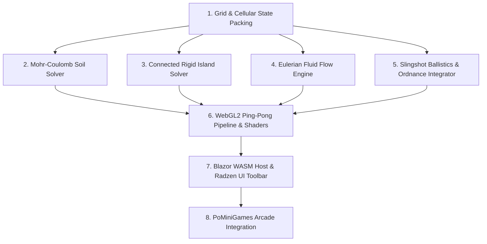

# Capability Map — Project Sub-Surface

## Overview
Project Sub-Surface decomposes into 8 independently testable capability modules.

---

## Capabilities & Module Breakdown

### 1. Grid & Cellular State Packing
* **Description:** Manages the $800 \times 600$ (480,000 cells) grid buffer representation, cell type IDs (`Air: 0`, `CohesiveSand: 1`, `Concrete: 2`, `Water: 3`, `Bedrock: 4`), velocity vectors ($V_x, V_y$), hydrostatic pressure, cohesion factor, and acoustic shockwave intensity.
* **Dependencies:** None (Foundation).
* **Test Strategy:** Unit tests verifying cell memory layout, coordinate translation, boundary clamping, and serialization.

### 2. Mohr-Coulomb Granular & Cohesive Soil Solver
* **Description:** Computes shear failure thresholds, internal friction angle ($\phi \approx 30^\circ$), cohesion factor ($c$), vertical trench stability, critical arch span ($L_{\text{crit}}$), and cave-in avalanche transitions.
* **Dependencies:** Module 1.
* **Test Strategy:** Pure algorithmic unit tests evaluating collapse under excessive overhangs vs. stable arch formation under standard spans.

### 3. Connected-Component Rigid Island Solver
* **Description:** Identifies contiguous horizontal and vertical concrete bar clusters, checks for anchor points (attached to bedrock or supported by stable sand), and translates unsupported bars downward as coherent rigid bodies.
* **Dependencies:** Module 1, Module 2.
* **Test Strategy:** Graph traversal unit tests verifying connected component detection, support detection, and rigid-body translation without deformation.

### 4. Eulerian-Lagrangian Fluid Dynamics Engine
* **Description:** Simulates incompressible, mass-conserving fluid movement, hydrostatic pressure equilibration ($P = \rho g h$), surface pooling without soil seepage, lateral boundary drainage ($X \le 0, X \ge 799$), and breach surge flooding.
* **Dependencies:** Module 1.
* **Test Strategy:** Simulation unit tests for volume conservation in closed vessels, lateral drain depletion, and breach velocity.

### 5. Slingshot Ballistics & Dynamic Ordnance Integrator
* **Description:** Translates user drag gestures into initial velocity vectors ($\vec{V}_0 = (\vec{P}_{\text{origin}} - \vec{P}_{\text{drag}}) \cdot k_{\text{velocity}}$), tracks projectile physics (restitution, friction, gravity), processes the 5.0-second dry TNT acoustic blast wave vs. water-submerged fuse extinction, and handles impact water balloon radial bursts.
* **Dependencies:** Module 1, Module 4.
* **Test Strategy:** Physics integration tests for projectile trajectory, water contact fuse suppression, and shockwave propagation radius.

### 6. WebGL2 Ping-Pong Pipeline & Shaders
* **Description:** Dual framebuffer object (FBO A $\leftrightarrow$ B) architecture executing cellular sub-steps (2–4 passes per 16.6ms frame), retro pixel-art palette color mapping, and dynamic acoustic flash visualization.
* **Dependencies:** Modules 1–5.
* **Test Strategy:** Shader compilation verification, WebGL context lifecycle tests, and headless render verification.

### 7. Blazor WASM Host & Radzen UI Toolbar
* **Description:** `SubSurfaceSandbox.razor` Blazor component incorporating Radzen Blazor controls (tool select bar, brush radius slider, numeric controls, simulation pause/step, preset switch, LocalStorage state save/load), binding to `subsurface-engine.js`.
* **Dependencies:** Module 6.
* **Test Strategy:** bUnit component rendering tests, event binding verification, and state snapshot lifecycle tests.

### 8. PoMiniGames Arcade Integration
* **Description:** Integration with `GameCatalog.cs`, navigation routing (`/subsurface`), kiosk demo mode compatibility, and dark arcade theme styling.
* **Dependencies:** Module 7.
* **Test Strategy:** Route navigation tests, catalog integrity verification, and E2E smoke tests.

---

## Build & Integration Sequence
1. **Phase 1-A:** Core Grid Models, Enums & Mathematical Solvers (Modules 1–5).
2. **Phase 1-B:** WebGL2 Engine & GLSL Shaders in `wwwroot/js/subsurface/` (Module 6).
3. **Phase 1-C:** Blazor Sandbox Razor Component & Radzen UI (Module 7).
4. **Phase 1-D:** Framework Catalog, Route & Preset Integration (Module 8).
5. **Phase 1-E:** Full Test Suite, Code Quality, Security & Optimization Review.
