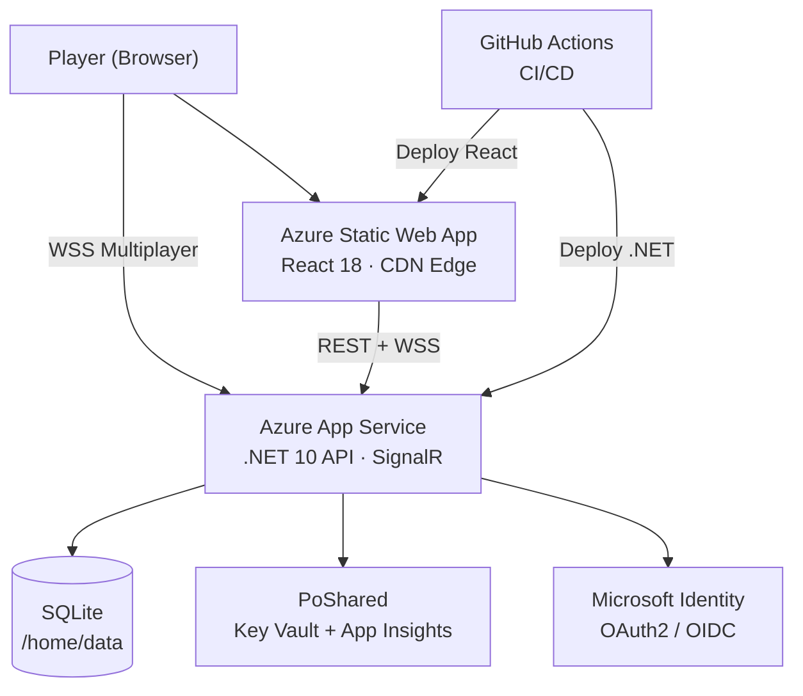

# PoMiniGames

Instant-play mini-games platform — 8 games, AI opponents, real-time 2P multiplayer, global leaderboards. Built with .NET 10 + React 18 + SignalR. Offline-resilient: every game works without an API connection.

## Games

| Game | AI | Multiplayer | Leaderboard |
|---|---|---|---|
| **Tic-Tac-Toe** | Easy / Medium / Hard | Online PvP | Win rate |
| **Connect Five** | Easy / Medium / Hard | Online PvP | Win rate |
| **PoFight** | CPU | Online PvP | Win rate |
| **Po Snake Game** | — | 2P live sync | High scores |
| **PoDropSquare** | — | — | Survival time |
| **PoBabyTouch** | — | — | Offline only |
| **PoRaceRagdoll** | CPU racers | Betting lobby | Session |
| **Voxel Shooter** | — | — | Offline only |

## Tech Stack

| Layer | Technology |
|---|---|
| Frontend | React 18 + TypeScript + Vite + Tailwind CSS v4 |
| Routing | React Router v6 |
| Real-time | SignalR WebSockets (`@microsoft/signalr` v10) |
| 3D / Physics | Three.js · Cannon-ES · Matter.js |
| Backend | .NET 10 Minimal API + MVC |
| Storage | SQLite (`/home/data/pominigames.db`) |
| Auth | Microsoft MSAL (OAuth2 JWT Bearer) + DevCookie |
| Logging | Serilog → file + console + App Insights |
| Telemetry | OpenTelemetry → Azure Application Insights |
| Secrets | Azure Key Vault (Managed Identity) + `dotnet user-secrets` |
| IaC | Azure Bicep + `azd` |
| Testing | xUnit · Testcontainers · Playwright · Vitest |

## Architecture



## Source Layout

```
src/
├── PoMiniGames/           # .NET 10 Backend API
│   ├── Features/          # Minimal API endpoints + SignalR hubs
│   │   ├── Auth/          # /api/auth/* + dev bypass
│   │   ├── Health/        # /api/health + /diag
│   │   ├── Leaderboard/   # /api/{game}/statistics/*
│   │   ├── HighScores/    # /api/snake/highscores + podropsquare
│   │   ├── Multiplayer/   # /api/multiplayer/* + MultiplayerHub
│   │   ├── Lobby/         # /api/lobby + LobbyHub
│   │   └── PoRaceRagdoll/ # /api/game/* race sessions
│   ├── Models/            # PlayerStats, SnakeHighScore, PoDropSquareHighScore
│   ├── DTOs/              # API contracts
│   ├── Services/          # StorageService, MultiplayerService, LobbyService
│   └── HealthChecks/      # /api/health checks
tests/
├── PoMiniGames.UnitTests/        # Pure logic tests (xUnit)
├── PoMiniGames.IntegrationTests/ # API + DB via Testcontainers
└── e2e/                          # Playwright E2E (Chromium)
src/PoMiniGames.Client/    # React 18 + TypeScript + Vite
    ├── components/        # Shared UI (Home, Lobby, GameLayout)
    ├── context/           # AuthContext (MSAL), PlayerNameContext
    └── games/             # 8 game modules + shared apiService
```

## Quick Start

```bash
# Install deps
dotnet restore
cd src/PoMiniGames.Client && npm install && cd ../..

# Set dev secrets
cd src/PoMiniGames/PoMiniGames
dotnet user-secrets set "PoMiniGames:MicrosoftAuth:ClientId" "<client-id>"
dotnet user-secrets set "PoMiniGames:MicrosoftAuth:ApiClientId" "<api-client-id>"
cd ../../..

# Launch (F5 in VS Code — kills dotnet, starts Vite, then API)
# API: http://localhost:5000  |  Client dev server: http://localhost:5173
```

## Documentation

| File | Type | Description |
|---|---|---|
| [docs/Architecture.mmd](./docs/Architecture.mmd) | Mermaid C4Context | Full Azure deployment topology (C4 Level 1) |
| [docs/Architecture_SIMPLE.mmd](./docs/Architecture_SIMPLE.mmd) | Mermaid flowchart | 7-node high-level context |
| [docs/SystemFlow.mmd](./docs/SystemFlow.mmd) | Mermaid sequenceDiagram | Auth + CRUD + SignalR multiplayer flow |
| [docs/SystemFlow_SIMPLE.mmd](./docs/SystemFlow_SIMPLE.mmd) | Mermaid flowchart | Simplified 4-path player journey |
| [docs/DataModel.mmd](./docs/DataModel.mmd) | Mermaid erDiagram | Full ERD — all entities and relationships |
| [docs/DataModel_SIMPLE.mmd](./docs/DataModel_SIMPLE.mmd) | Mermaid erDiagram | Core tables only |
| [docs/ProductSpec.md](./docs/ProductSpec.md) | Markdown | PRD — Why, features, business rules, success metrics |
| [docs/DevOps.md](./docs/DevOps.md) | Markdown | CI/CD, secrets, Docker Compose, Day 1 onboarding |

## Screenshots

| Lobby | Multiplayer |
|---|---|
|  |  |

## Key Endpoints

| Endpoint | Description |
|---|---|
| `GET /api/health/ping` | Liveness probe — returns `"pong"` |
| `GET /api/health` | Structured health report (SQLite status) |
| `GET /diag` | Masked config dump (dev/staging only) |
| `GET /scalar` | OpenAPI UI (Scalar — purple theme) |
| `GET /api/auth/me` | Authenticated user profile |
| `GET /api/{game}/statistics/leaderboard` | Top 10 by win rate |
| `WS /api/hubs/lobby` | Pre-game lobby (SignalR) |
| `WS /api/hubs/multiplayer` | Real-time game moves (SignalR) |
| [docs/ProductSpec.md](./docs/ProductSpec.md) | Markdown | PRD, game catalog, API surface, success metrics |
| [docs/DevOps.md](./docs/DevOps.md) | Markdown | CI/CD, secrets, Docker Compose, blast radius |
| [docs/screenshots/](./docs/screenshots/) | Images | App screenshots for visual reference |

## Quick Start

### Prerequisites

- .NET 10 SDK (`dotnet --version` → `10.x`)
- Node.js 20+ (`node --version`)

### Local Development

1. **Start the Backend API (hosts the React client):**
   ```bash
   cd src/PoMiniGames/PoMiniGames
   dotnet run
   ```

2. **Open the app:** http://localhost:5000

3. **Optional hot-reload frontend mode (new terminal):**
   ```bash
   cd src/PoMiniGames.Client
   npm install
   npm run dev
   ```

4. **Hot-reload app URL:** http://localhost:5173

5. **Run the local smoke check:** use the VS Code task `smoke-local` after the client and API are running.

## API Endpoints

| Method | Endpoint | Description |
|--------|----------|-------------|
| GET | `/api/health/ping` | Health check |
| GET | `/api/{game}/players/{player}/stats` | Get player stats |
| PUT | `/api/{game}/players/{player}/stats` | Save player stats |
| GET | `/api/{game}/statistics/leaderboard` | Get leaderboard |
| GET | `/api/{game}/statistics/all` | Get all stats |

## Games

| Route | Game | Mode | Difficulty | Stats |
|---|---|---|---|---|
| `/tictactoe` | Tic-Tac-Toe | PvAI · PvP · Demo | Easy/Medium/Hard | PlayerStats |
| `/connectfive` | Connect Five | PvAI · PvP · Demo | Easy/Medium/Hard | PlayerStats |
| `/pofight` | PoFight | PvCPU · CPUvCPU · Demo | Easy/Medium/Hard | PlayerStats |
| `/posnakegame` | Po Snake Game | Solo arena | — | SnakeHighScore |
| `/podropsquare` | PoDropSquare | Physics survival | — | PoDropSquareHighScore |
| `/pobabytouch` | PoBabyTouch | Tap sensory | — | Local only |
| `/poraceragdoll` | PoRaceRagdoll | Betting + racing | — | RaceSession |
| `/voxelshooter` | Voxel Shooter | FPS WebGL | — | Local only |

## Testing

```bash
# Run unit tests
dotnet test tests/PoMiniGames.UnitTests

# Run integration tests
dotnet test tests/PoMiniGames.IntegrationTests

# Run E2E tests
cd tests/e2e
npm install
npx playwright test
```

## Deployment

See [docs/DevOps.md](./docs/DevOps.md) for full CI/CD pipeline, Docker Compose, secrets setup, and blast radius assessment.

```bash
# Provision and deploy to Azure
azd auth login
azd up
```

## Configuration

### Development
Configuration is in `appsettings.Development.json`:
- Local SQLite storage
- CORS: localhost:5173
- Diagnostics enabled at `/diag`
- Rolling application logs written to `src/PoMiniGames/PoMiniGames/logs/pominigames-.log`

### Production
Configuration is in `appsettings.json`:
- SQLite storage
- Azure Key Vault integration
- Production CORS settings
- Diagnostics disabled by default unless explicitly re-enabled

## Contributing

1. Fork the repository
2. Create a feature branch
3. Make your changes
4. Run tests
5. Submit a pull request

## License

ISC License - See LICENSE file for details

## Screenshots

See the `screenshots/` folder for application screenshots.
