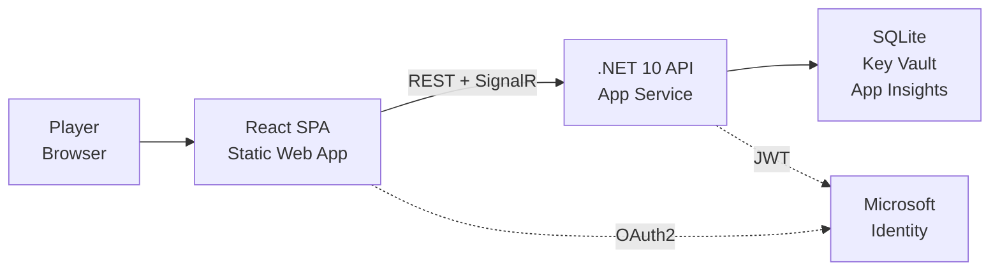

# PoMiniGames

A modern web-based mini-games platform featuring classic games with AI opponents, persistent player statistics, and competitive leaderboards.

## Overview

PoMiniGames is a full-stack web application built with .NET 10 and React 18. It provides an engaging platform for players to enjoy classic games like Tic-Tac-Toe and Connect Five against AI opponents at various difficulty levels.

### Key Features

- **Tic-Tac-Toe**: Classic 3x3 grid game with AI opponents
- **Connect Five**: Connect 5 in a row on a 6x5 grid
- **PoSnakeGame — Battle Arena**: Real-time 2-player snake survival game with live opponent synchronization
- **Difficulty Levels**: Easy, Medium, and Hard AI opponents
- **Player Statistics**: Track wins, losses, draws, and win streaks
- **Leaderboards**: Compete with other players
- **Health & Diagnostics**: Integrated health monitoring and diagnostic endpoints:
    - `/api/health`: Comprehensive system health status (Azure Table Storage, etc.)
    - `/diag`: Filtered configuration and secrets visibility (masked for security)
- **Offline Support**: Works without internet using local storage
- **Online Multiplayer**: Real-time 2P via SignalR (`/api/hubs/lobby` + `/api/hubs/multiplayer`)

## Tech Stack

| Layer | Technology |
|---|---|
| Frontend | React 18 + TypeScript + Vite |
| Routing | React Router v6 |
| Real-time | SignalR (WebSockets) |
| Backend | .NET 10 Minimal API + MVC (PoRaceRagdoll) |
| Storage | SQLite via Microsoft.Data.Sqlite |
| Auth | Microsoft Identity (MSAL) — JWT Bearer + DevCookie |
| Logging | Serilog (file + console + App Insights sink) |
| Telemetry | OpenTelemetry → Azure Application Insights |
| Secrets | Azure Key Vault (Managed Identity) + dotnet user-secrets |
| IaC | Azure Bicep + `azd` |
| Testing | xUnit + Testcontainers (integration) + Playwright (E2E) |

## Architecture



**Source layout:**
```
src/
├── PoMiniGames/           # .NET 10 Backend API
│   ├── Features/          # Minimal API endpoints + SignalR hubs
│   ├── Models/            # Domain models (PlayerStats, HighScores)
│   ├── DTOs/              # API contracts
│   ├── Services/          # Storage, auth, multiplayer services
│   └── HealthChecks/      # /api/health checks
tests/
│   ├── PoMiniGames.UnitTests/       # Pure logic tests
│   ├── PoMiniGames.IntegrationTests/ # API + DB via Testcontainers
│   └── e2e/                         # Playwright E2E
src/PoMiniGames.Client/    # React 18 + TypeScript + Vite
    ├── components/        # Shared UI components
    ├── context/           # AuthContext, PlayerNameContext
    └── games/             # Per-game modules (8 games)
```

## Documentation

Comprehensive documentation is available in the `docs/` folder:

### Architecture & Design

| Document | Description |
|----------|-------------|
| [docs/Architecture.mmd](./docs/Architecture.mmd) | System Context + Container Architecture |
| [docs/ApplicationFlow.mmd](./docs/ApplicationFlow.mmd) | Auth Flow + User Journey |
| [docs/DataModel.mmd](./docs/DataModel.mmd) | Database Schema + State Transitions |
| [docs/ComponentMap.mmd](./docs/ComponentMap.mmd) | Component Tree + Dependencies |
| [docs/DataPipeline.mmd](./docs/DataPipeline.mmd) | Data Workflow + User Workflow |

### Product & API

| Document | Description |
|----------|-------------|
| [docs/ProductSpec.md](./docs/ProductSpec.md) | PRD + Success Metrics |
| [docs/ApiContract.md](./docs/ApiContract.md) | API Specs + Error Handling |

### Operations

| Document | Description |
|----------|-------------|
| [docs/DevOps.md](./docs/DevOps.md) | Deployment Pipeline + Secrets |
| [docs/LocalSetup.md](./docs/LocalSetup.md) | Day 1 Guide + Docker |

---

> **Consolidated docs** — the tables above are superseded by the high-density files in `docs/`:

| File | Type | Description |
|---|---|---|
| [docs/Architecture.mmd](./docs/Architecture.mmd) | Mermaid | Full Azure deployment topology (C4 Level 1) |
| [docs/Architecture_SIMPLE.mmd](./docs/Architecture_SIMPLE.mmd) | Mermaid | High-level 5-node context |
| [docs/SystemFlow.mmd](./docs/SystemFlow.mmd) | Mermaid | Auth + Stats + Leaderboard + Multiplayer sequence |
| [docs/SystemFlow_SIMPLE.mmd](./docs/SystemFlow_SIMPLE.mmd) | Mermaid | Simplified 4-flow lanes |
| [docs/DataModel.mmd](./docs/DataModel.mmd) | Mermaid | Full ERD — all entities and relationships |
| [docs/DataModel_SIMPLE.mmd](./docs/DataModel_SIMPLE.mmd) | Mermaid | Core entities only |
| [docs/ProductSpec.md](./docs/ProductSpec.md) | Markdown | PRD, game catalog, API surface, success metrics |
| [docs/DevOps.md](./docs/DevOps.md) | Markdown | CI/CD, secrets, Docker Compose, blast radius |
| [docs/screenshots/](./docs/screenshots/) | Images | App screenshots for visual reference |

## Quick Start

### Prerequisites

- .NET 10 SDK (`dotnet --version` → `10.x`)
- Node.js 20+ (`node --version`)

### Local Development

1. **Start the Backend API:**
   ```bash
   cd src/PoMiniGames/PoMiniGames
   dotnet run
   ```

2. **Start the Frontend (new terminal):**
   ```bash
   cd src/PoMiniGames.Client
   npm install
   npm run dev
   ```

3. **Open the app:** http://localhost:5173

4. **Run the local smoke check:** use the VS Code task `smoke-local` after the client and API are running.

## API Endpoints

| Method | Endpoint | Description |
|--------|----------|-------------|
| GET | `/api/health/ping` | Health check |
| GET | `/api/{game}/players/{player}/stats` | Get player stats |
| PUT | `/api/{game}/players/{player}/stats` | Save player stats |
| GET | `/api/{game}/statistics/leaderboard` | Get leaderboard |
| GET | `/api/{game}/statistics/all` | Get all stats |

## Games

| Route | Game | Mode | Difficulty | Stats |
|---|---|---|---|---|
| `/tictactoe` | Tic-Tac-Toe | PvAI · PvP · Demo | Easy/Medium/Hard | PlayerStats |
| `/connectfive` | Connect Five | PvAI · PvP · Demo | Easy/Medium/Hard | PlayerStats |
| `/pofight` | PoFight | PvCPU · CPUvCPU · Demo | Easy/Medium/Hard | PlayerStats |
| `/posnakegame` | Po Snake Game | Solo arena | — | SnakeHighScore |
| `/podropsquare` | PoDropSquare | Physics survival | — | PoDropSquareHighScore |
| `/pobabytouch` | PoBabyTouch | Tap sensory | — | Local only |
| `/poraceragdoll` | PoRaceRagdoll | Betting + racing | — | RaceSession |
| `/voxelshooter` | Voxel Shooter | FPS WebGL | — | Local only |

## Testing

```bash
# Run unit tests
dotnet test tests/PoMiniGames.UnitTests

# Run integration tests
dotnet test tests/PoMiniGames.IntegrationTests

# Run E2E tests
cd tests/e2e
npm install
npx playwright test
```

## Deployment

See [docs/DevOps.md](./docs/DevOps.md) for full CI/CD pipeline, Docker Compose, secrets setup, and blast radius assessment.

```bash
# Provision and deploy to Azure
azd auth login
azd up
```

## Configuration

### Development
Configuration is in `appsettings.Development.json`:
- Local SQLite storage
- CORS: localhost:5173
- Diagnostics enabled at `/diag`
- Rolling application logs written to `src/PoMiniGames/PoMiniGames/logs/pominigames-.log`

### Production
Configuration is in `appsettings.json`:
- SQLite storage
- Azure Key Vault integration
- Production CORS settings
- Diagnostics disabled by default unless explicitly re-enabled

## Contributing

1. Fork the repository
2. Create a feature branch
3. Make your changes
4. Run tests
5. Submit a pull request

## License

ISC License - See LICENSE file for details

## Screenshots

See the `screenshots/` folder for application screenshots.
