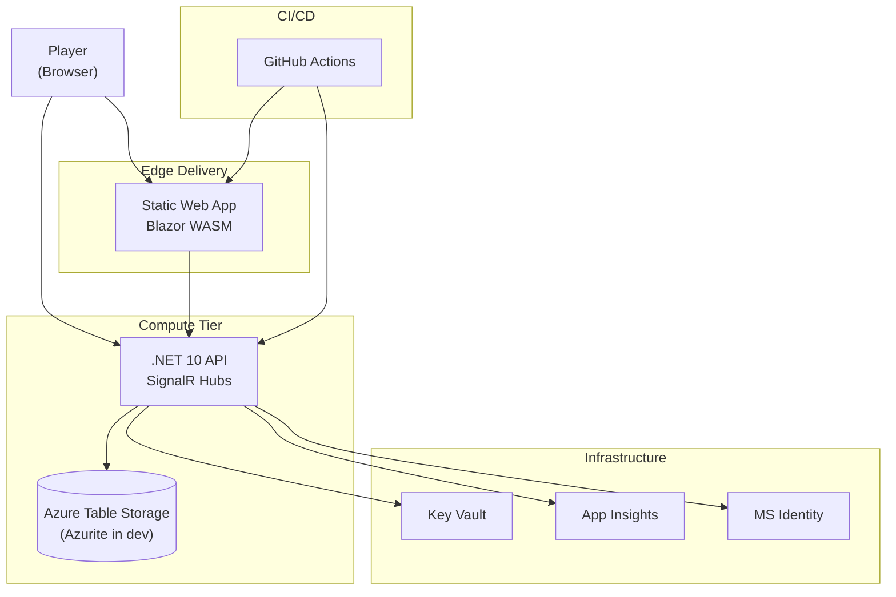

# PoMiniGames

Instant-play mini-games platform — 8 games, AI opponents, real-time 2P multiplayer, global leaderboards. Built with .NET 10 + Blazor WebAssembly + SignalR. Offline-resilient: every game works without an API connection.

## Games

| Game | AI | Multiplayer | Leaderboard |
|---|---|---|---|
| **Tic-Tac-Toe** | Easy / Medium / Hard | Online PvP | Win rate |
| **Connect Five** | Easy / Medium / Hard | Online PvP | Win rate |
| **PoFight** | CPU | Online PvP | Win rate |
| **Po Snake Game** | — | 2P live sync | High scores |
| **PoDropSquare** | — | — | Survival time |
| **PoBabyTouch** | — | — | Offline only |
| **PoRaceRagdoll** | CPU racers | Betting lobby | Session |
| **Voxel Shooter** | — | — | Offline only |

## Tech Stack

| Layer | Technology |
|---|---|
| Frontend | Blazor WebAssembly (C#) + Radzen UI |
| Routing | Blazor Router |
| Real-time | SignalR WebSockets (`Microsoft.AspNetCore.SignalR.Client`) |
| Backend | .NET 10 Minimal API |
| Storage | Azure Table Storage (Azurite emulator in dev) |
| Auth | Microsoft MSAL (OAuth2 JWT Bearer) + DevCookie |
| Logging | Serilog → file + console + App Insights |
| Telemetry | OpenTelemetry → Azure Application Insights |
| Secrets | Azure Key Vault (Managed Identity) + `dotnet user-secrets` |
| IaC | Azure Bicep + `azd` |
| Testing | xUnit · Playwright |

## Architecture


```mermaid
flowchart TD
    Player["Player\n(Browser)"]
    
    subgraph Edge["Edge Delivery"]
        SWA["Static Web App\nBlazor WASM"]
    end
    
    subgraph Compute["Compute Tier"]
        API[".NET 10 API\nSignalR Hubs"]
        Tables[("Azure Table Storage\n(Azurite in dev)")]
    end
    
    subgraph Infra["Infrastructure"]
        KV["Key Vault"]
        AppIns["App Insights"]
        MSID["MS Identity"]
    end
    
    subgraph CICD["CI/CD"]
        GH["GitHub Actions"]
    end
    
    Player --> SWA
    Player --> API
    SWA --> API
    API --> Tables
    API --> KV
    API --> AppIns
    API --> MSID
    GH --> API
    GH --> SWA
```

## Source Layout

```
src/
├── PoMiniGames.Application/   # Application services & DTOs
├── PoMiniGames.Client/        # Blazor WebAssembly client
│   ├── Components/            # Shared UI (GameShell, HomeHighScores)
│   ├── Games/                 # Game modules (TicTacToe, ConnectFive, etc.)
│   ├── Services/              # API, Auth, GameStats services
│   ├── Layout/                # MainLayout, navigation
│   └── Pages/                 # Index, SinglePlayer, OnlineMultiplayer
├── PoMiniGames.Domain/        # Domain models (PlayerStats, HighScores)
├── PoMiniGames.Infrastructure/ # Azure storage & health checks
├── PoMiniGames/               # .NET 10 API Host
├── PoShared/                  # Shared utilities (Identity, Diagnostics)
tests/
├── PoMiniGames.Unit/          # Pure logic tests (xUnit) — namespace PoMiniGames.Unit
├── PoMiniGames.Integration/   # API + DB integration tests (Testcontainers.Azurite) — namespace PoMiniGames.Integration
├── E2EAPI/                    # Pure HTTP-contract API tests (WebApplicationFactory)
└── E2EUI/                     # Playwright-driven UI tests
```

## Documentation

All diagrams are in [`/docs`](./docs). Each `.mmd` file has a corresponding `_SIMPLE.mmd` for stakeholder review and `.html` for browser viewing.

### 1. Architecture & CI/CD

| File | Type | Description |
|---|---|---|
| [docs/Architecture_MASTER.mmd](./docs/Architecture_MASTER.mmd) | flowchart | Hybrid C4 L1/L2 — Edge, Compute, Data, Identity, CI/CD |
| [docs/Architecture_MASTER.html](./docs/Architecture_MASTER.html) | HTML | Rendered view |
| [docs/ReleasePipeline_MASTER.mmd](./docs/ReleasePipeline_MASTER.mmd) | flowchart | Feature → Build → Test → Artifact → Deploy → Prod |
| [docs/ReleasePipeline_MASTER.html](./docs/ReleasePipeline_MASTER.html) | HTML | Rendered view |

### 2. User Usage & Behavioral Flowcharts

| File | Type | Description |
|---|---|---|
| [docs/OnboardingJourney.mmd](./docs/OnboardingJourney.mmd) | flowchart | New user path — anonymous play → auth → Aha moment |
| [docs/OnboardingJourney.html](./docs/OnboardingJourney.html) | HTML | Rendered view |
| [docs/PrimaryValueFlow.mmd](./docs/PrimaryValueFlow.mmd) | flowchart | Happy path — visit → select → play → stats → leaderboard |
| [docs/PrimaryValueFlow.html](./docs/PrimaryValueFlow.html) | HTML | Rendered view |
| [docs/ExceptionUserFlows.mmd](./docs/ExceptionUserFlows.mmd) | flowchart | Auth errors · offline resilience · multiplayer disconnection · rate limiting |
| [docs/ExceptionUserFlows.html](./docs/ExceptionUserFlows.html) | HTML | Rendered view |

### 3. Logic & State Dynamics

| File | Type | Description |
|---|---|---|
| [docs/SystemFlow_MASTER.mmd](./docs/SystemFlow_MASTER.mmd) | sequenceDiagram | Full system — Startup secrets → Auth → Stats CRUD → Multiplayer |
| [docs/SystemFlow_MASTER.html](./docs/SystemFlow_MASTER.html) | HTML | Rendered view |
| [docs/StateDynamics_MASTER.mmd](./docs/StateDynamics_MASTER.mmd) | stateDiagram-v2 | Match · Lobby · Race Session · PlayerStats lifecycles |
| [docs/StateDynamics_MASTER.html](./docs/StateDynamics_MASTER.html) | HTML | Rendered view |

### 4. Data & Security Schema

| File | Type | Description |
|---|---|---|
| [docs/DataModel.mmd](./docs/DataModel.mmd) | erDiagram | Full ERD — PlayerStats · HighScores · Match · Lobby · Race with PKs and enums |
| [docs/DataModel.html](./docs/DataModel.html) | HTML | Rendered view |
| [docs/AccessControl_MATRIX.mmd](./docs/AccessControl_MATRIX.mmd) | flowchart | Roles (Anonymous · Auth · Host · Dev) mapped to every endpoint group |
| [docs/AccessControl_MATRIX.html](./docs/AccessControl_MATRIX.html) | HTML | Rendered view |
| [docs/DataLifecycle_MASTER.mmd](./docs/DataLifecycle_MASTER.mmd) | flowchart | Ingest → Rate-limit → Auth → Sanitize → UPSERT → Store → Serve |
| [docs/DataLifecycle_MASTER.html](./docs/DataLifecycle_MASTER.html) | HTML | Rendered view |

### 5. Dependency & UI Hierarchy

| File | Type | Description |
|---|---|---|
| [docs/SystemInteractionFlow.mmd](./docs/SystemInteractionFlow.mmd) | sequenceDiagram | Real-time multiplayer — queue → lobby → SignalR move sync → stats |
| [docs/SystemInteractionFlow.html](./docs/SystemInteractionFlow.html) | HTML | Rendered view |
| [docs/ServiceMap_MASTER.mmd](./docs/ServiceMap_MASTER.mmd) | flowchart | Full service dependency graph — source of truth for blast radius assessment |
| [docs/ServiceMap_MASTER.html](./docs/ServiceMap_MASTER.html) | HTML | Rendered view |
| [docs/InterfaceHierarchy_MASTER.mmd](./docs/InterfaceHierarchy_MASTER.mmd) | flowchart | Blazor component tree — routes · shared components · game modules · state layer |
| [docs/InterfaceHierarchy_MASTER.html](./docs/InterfaceHierarchy_MASTER.html) | HTML | Rendered view |

### Simple Variants (High-Level Stakeholder Review)

All `_SIMPLE.mmd` and `_SIMPLE.html` files contain condensed versions for rapid executive review.

---

## Product Requirements Document (PRD)

### 1. Overview

PoMiniGames is an instant-play mini-games platform designed for accessibility and engagement. The platform enables players to enjoy 8 distinct games with AI opponents and real-time multiplayer functionality. The system prioritizes offline resilience, ensuring games remain playable even without an active internet connection.

### 2. Target Users

**Primary Persona:** Casual gamers seeking quick, accessible entertainment with competitive elements. Users range from ages 8 to 65, with varying technical proficiency. The platform appeals to players who enjoy brief gaming sessions without the commitment of extensive downloads or account creation requirements.

**Secondary Persona:** Competitive players interested in leaderboards, multiplayer engagement, and skill progression through ELO rating systems.

### 3. Core Features

#### 3.1 Game Library

The platform hosts 8 games with distinct mechanics:

- **Tic-Tac-Toe**: Classic 3x3 grid game with AI opponent featuring three difficulty levels (Easy, Medium, Hard). Hard mode implements Minimax algorithm with depth-4 search and transposition table optimization.
- **Connect Five**: Vertical gravity-based game on 15x15 grid requiring 5-in-a-row to win. AI uses heuristic board evaluation for Medium/Easy difficulties.
- **PoFight**: 2D arena fighter with CPU opponents. Supports both player vs CPU and CPU vs CPU demo modes.
- **Po Snake Game**: Canvas-based snake arena with multiplayer synchronization via SignalR. 30-second battle mode with high score tracking.
- **PoDropSquare**: Physics-based survival game using Matter.js. Players drop squares to avoid obstacles, with survival time as scoring metric.
- **PoBabyTouch**: Sensory tap game designed for younger audiences.
- **PoRaceRagdoll**: Physics-driven racing game with Cannon.js track rendering. Includes betting system for enhanced engagement.
- **Voxel Shooter**: WebGL 3D map first-person shooter experience using Three.js.

#### 3.2 AI System

All AI-powered games implement difficulty scaling:

- **Easy**: 30% block chance with random valid moves
- **Medium**: Priority-based heuristic (Win > Block > Center > Random)
- **Hard**: Full Minimax search with alpha-beta pruning, transposition tables, depth-4 evaluation

#### 3.3 Multiplayer System

Real-time 2P multiplayer via SignalR WebSockets:

- Matchmaking queue with game key routing
- Lobby system with host election (first player to join)
- GameStarting broadcast to all lobby members
- SendRealtimeInput hub method for move synchronization
- JoinSpectatorGroup for read-only match observation
- Eventual consistency model — client-side state application, no server arbitration

#### 3.4 Statistics & Leaderboards

Player progress tracking across difficulty levels:

- Per-game statistics: Wins, Losses, Draws, TotalGames, WinStreak
- ELO rating computation (deterministic, recomputable from W/L/D counts)
- JSON property storage strategy for flexible schema evolution
- Leaderboards ranked in-memory from a single Table Storage partition scan (small data sets)

#### 3.5 Authentication

Microsoft Identity Platform integration:

- OAuth2 PKCE flow via MSAL browser SDK
- JWT Bearer token validation (12h TTL)
- In-memory token cache
- Silent refresh on token expiration
- Popup blocking fallback to redirect flow
- Development bypass via DevAuth cookie (disabled in production)

### 4. Non-Functional Requirements

#### 4.1 Performance

- CDN-served Blazor WASM with target sub-1s cold load
- Lazy-loaded game bundles reducing initial payload
- Leaderboard query p95 target: < 200ms
- API timeout: 5 seconds for all HTTP calls

#### 4.2 Availability

- Offline-resilient gameplay (all games functional without API)
- LocalStorage caching with opportunistic sync on reconnection
- Health check endpoints for liveness and readiness probes

#### 4.3 Security

- JWT validation at API boundary
- Input sanitization preventing SQL injection
- Rate limiting: 10 requests/minute/IP for high-score submissions
- Key Vault integration with Managed Identity (no stored credentials)
- Player name validation against invalid filename characters

#### 4.4 Observability

- Serilog structured logging to file and console
- OpenTelemetry OTLP export to Application Insights
- Secret masking before log emission
- Diagnostics endpoint (`/diag`) for masked config dump (dev only)

### 5. Data Model

Core entities: PlayerStats (composite PK: Game + PlayerName), SnakeHighScores, PoDropSquareHighScores, MultiplayerMatch, LobbyPlayer, RaceSession.

All timestamps stored as ISO 8601 UTC. PlayerStats uses JSON column strategy enabling schema evolution without migrations.

### 6. API Surface

| Method | Endpoint | Auth | Description |
|--------|----------|------|-------------|
| GET | `/api/health/ping` | None | Liveness probe |
| GET | `/api/health` | None | Full health report |
| GET | `/api/auth/config` | None | MSAL configuration |
| POST | `/api/auth/dev-login` | Dev | Development bypass |
| GET | `/api/auth/me` | Bearer | User profile |
| GET | `/api/{game}/statistics/leaderboard` | None | Top 10 by win rate |
| PUT | `/api/{game}/players/{name}/stats` | Bearer | Upsert player stats |
| GET | `/api/snake/highscores` | None | Snake leaderboard |
| POST | `/api/snake/highscores` | Rate | Submit snake score |
| GET | `/api/podropsquare/highscores` | None | PoDropSquare leaderboard |
| POST | `/api/podropsquare/highscores` | Rate | Submit survival score |
| POST | `/api/multiplayer/queue` | Bearer | Join matchmaking |
| WSS | `/api/hubs/lobby` | JWT | Lobby management |
| WSS | `/api/hubs/multiplayer` | JWT | Real-time game sync |

### 7. Deployment

- **API**: Azure App Service Linux B1 backed by an Azure Storage account (Table Storage)
- **Client**: Azure Static Web App with CDN distribution
- **CI/CD**: GitHub Actions with OIDC federation (no stored credentials)
- **Secrets**: Azure Key Vault with System Managed Identity

### 8. Testing Strategy

- **Unit Tests**: xUnit for domain logic (EloCalculator, identity helpers)
- **Integration Tests**: xUnit + WebApplicationFactory for API stack
- **E2E Tests**: Playwright for full browser + API workflows

---

## Quick Start

```bash
# Install deps
dotnet restore
cd src/PoMiniGames.Client && npm install && cd ../..

# Start the storage emulator (Azurite) — the API persists to Azure Table Storage,
# emulated locally by Azurite. The dev connection string is "UseDevelopmentStorage=true".
docker compose up -d azurite        # Table service on localhost:10002, data in a named volume

# Set dev secrets
cd src/PoMiniGames/PoMiniGames
dotnet user-secrets set "PoMiniGames:MicrosoftAuth:ClientId" "<client-id>"
dotnet user-secrets set "PoMiniGames:MicrosoftAuth:ApiClientId" "<api-client-id>"
cd ../../..

# Launch (F5 in VS Code — kills dotnet, starts Vite, then API)
# API: http://localhost:5000  |  Client dev server: http://localhost:5173
```

### Storage (Azure Table Storage + Azurite)

- The app persists player stats and high scores to **Azure Table Storage**. Tables
  (`PlayerStats`, `SnakeHighScores`, `PoDropSquareHighScores`, `MarbleRaceHighScores`) are
  created automatically on startup.
- **Local dev** uses the **Azurite** emulator via `docker compose up -d azurite`. Configured by
  `PoMiniGames:Storage:TableService:ConnectionString = "UseDevelopmentStorage=true"` in
  `appsettings.Development.json`.
- **Production** points at a real Azure Storage account — set either a `ConnectionString`, or an
  `Endpoint`/`AccountName` (used with Managed Identity via `DefaultAzureCredential`) under
  `PoMiniGames:Storage:TableService`.
- Integration tests spin up a throwaway Azurite container automatically via Testcontainers
  (requires Docker).

## Testing

```bash
# Run unit tests
dotnet test tests/PoMiniGames.Unit/PoMiniGames.Unit.csproj

# Run integration tests
dotnet test tests/PoMiniGames.Integration/PoMiniGames.Integration.csproj

# Run E2E API tests (pure HTTP)
dotnet test tests/E2EAPI/E2EAPI.csproj

# Run E2E UI tests (Playwright)
dotnet test tests/E2EUI/E2EUI.csproj
```

## Deployment

```bash
# Provision and deploy to Azure
azd auth login
azd up
```

## Key Endpoints

| Endpoint | Description |
|---|---|
| `GET /api/health/ping` | Liveness probe — returns `"pong"` |
| `GET /api/health` | Structured health report (Table Storage status) |
| `GET /diag` | Masked config dump (dev/staging only) |
| `GET /scalar` | OpenAPI UI (Scalar — purple theme) |
| `GET /api/auth/me` | Authenticated user profile |
| `GET /api/{game}/statistics/leaderboard` | Top 10 by win rate |
| `WS /api/hubs/lobby` | Pre-game lobby (SignalR) |
| `WS /api/hubs/multiplayer` | Real-time game moves (SignalR) |

## Screenshots

See the [`screenshots/`](./screenshots/) folder for application screenshots.

## Contributing

1. Fork the repository
2. Create a feature branch
3. Make your changes
4. Run tests
5. Submit a pull request

## License

ISC License - See LICENSE file for details