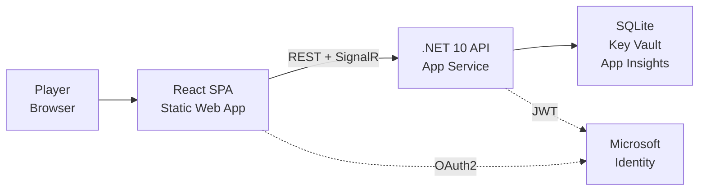

# ProductSpec.md — PRD + Success Metrics

**Project:** PoMiniGames | **Status:** Active | **Stack:** React 18 + .NET 10 + Azure

---

## Why This Exists

PoMiniGames gives players a single destination for casual, low-friction mini-games with:
- Instant play (no install, no account required for solo play)
- Competitive stats and leaderboards to drive retention
- Offline resilience — the app degrades gracefully when the API is unavailable
- AI opponents at three difficulty tiers to serve all skill levels

---

## Games Catalog

| Game | Grid / Mode | Difficulty | Multiplayer | Storage |
|---|---|---|---|---|
| Tic-Tac-Toe | 3×3 grid | Easy/Medium/Hard | Online PvP + Demo | PlayerStats (SQLite) |
| Connect Five | 6×5 grid — 5-in-a-row | Easy/Medium/Hard | Online PvP + Demo | PlayerStats (SQLite) |
| PoFight | 2D fighting — PvCPU/CPUvCPU | Easy/Medium/Hard | CPUvCPU Demo | PlayerStats (SQLite) |
| Po Snake Game | Multi-snake 30 s arena | N/A | N/A | SnakeHighScore (SQLite) |
| PoDropSquare | Physics block survival | N/A | N/A | PoDropSquareHighScore (SQLite) |
| PoBabyTouch | Bubble-pop tap sensory | N/A | N/A | Local storage only |
| PoRaceRagdoll | Physics ragdoll racing + betting | N/A | Betting lobby | RaceSession (in-memory) |
| Voxel Shooter | FPS voxel shooting (WebGL) | N/A | N/A | Local storage only |

---

## Game Modes

| Mode | Description |
|---|---|
| PvAI | Single player vs AI (Easy/Medium/Hard) |
| Online PvP | Real-time 2P via SignalR lobby + multiplayer hub |
| Demo / CPUvCPU | Watch two AI agents play — no stats recorded |

---

## Stats Tracked

| Scope | Fields |
|---|---|
| Per player per game per difficulty | Wins, Losses, Draws, TotalGames, WinStreak, WinRate |
| Aggregate per player per game | TotalWins, TotalLosses, TotalDraws, TotalGames, WinRate |
| Snake | Score, SnakeLength, FoodEaten, GameDuration |
| PoDropSquare | SurvivalTime, PlayerInitials |
| Race | WinnerName, RaceSession metadata |

Stats sync to the API on each game result. If the API is unavailable, results are queued in local storage and retried.

---

## Architecture Overview

---

## API Surface

| Method | Endpoint | Auth | Description |
|---|---|---|---|
| GET | `/api/health/ping` | None | Liveness check |
| GET | `/api/health` | None | Full health with dependency status |
| GET | `/diag` | None | Masked config dump (dev only) |
| GET | `/api/{game}/players/{id}/stats` | None | Get player stats |
| PUT | `/api/{game}/players/{id}/stats` | JWT Bearer | Save/update player stats |
| GET | `/api/{game}/statistics/leaderboard` | None | Top 10 leaderboard (rate-limited) |
| GET | `/api/{game}/statistics/all` | None | All player stats |
| GET | `/api/podropsquare/highscores` | None | PoDropSquare top scores |
| POST | `/api/podropsquare/highscores` | None | Submit PoDropSquare score |
| GET | `/api/snake/highscores` | None | Snake top scores |
| POST | `/api/snake/highscores` | None | Submit Snake score |
| WS | `/api/hubs/lobby` | JWT required | SignalR lobby hub |
| WS | `/api/hubs/multiplayer` | JWT required | SignalR game hub |
| * | `/api/raceragdoll/*` | None | MVC controller for race management |

**Rate Limiting:** `highscores` policy — 10 requests/min per IP (fixed window)

---

## Security Model

| Layer | Mechanism |
|---|---|
| Authentication | JWT Bearer (MSAL) + DevCookie scheme (dev only) |
| Authorization | Policy-based: JWT header → Bearer; Cookie → DevCookie |
| Secrets | Azure Key Vault via Managed Identity; dotnet user-secrets locally |
| CORS | Allowlist: localhost:5000, 5001, 5173 (configurable) |
| Transport | HTTPS-only on App Service; HTTP allowed locally |

---

## Offline Resilience

The React client operates fully without an API connection for single-player games:
- Stats are written to `localStorage` keys: `pomini_stats_{game}_{player}`
- Failed API syncs are queued and retried via `statsService.ts`
- Leaderboard falls back to local data gracefully
- No API = no multiplayer; lobby and multiplayer pages require auth

---

## Performance Targets

| Metric | Target |
|---|---|
| First Contentful Paint | < 1.5 s |
| Time to Interactive | < 3.0 s |
| API P95 response time | < 200 ms |
| Availability (uptime) | > 99.9% |
| Leaderboard cache TTL | 60 s (rate-limited at source) |

---

## Success Metrics

| Metric | Definition | Target |
|---|---|---|
| DAU (Daily Active Users) | Unique players per day | 50+ |
| Avg games per session | Games started / sessions | ≥ 2 |
| Stats sync rate | API PUT successes / game results | > 95% |
| Auth conversion | Players who log in / total visitors | > 40% |
| P95 API latency | 95th percentile API response | < 200 ms |
| Zero-downtime deploys | Deploy without >0 dropped requests | 100% |
