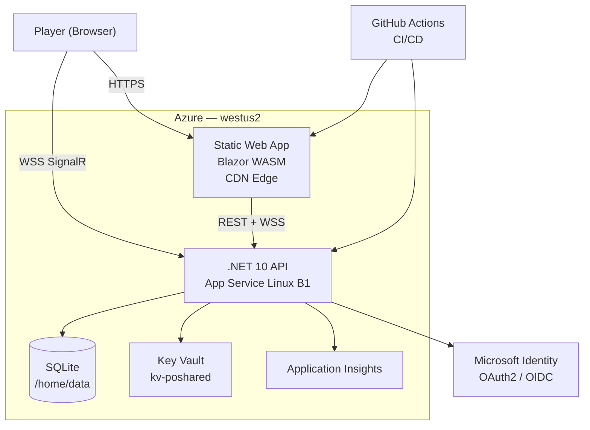
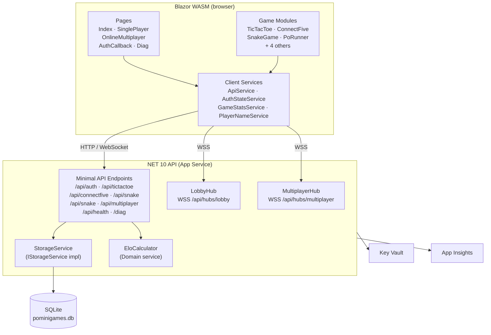
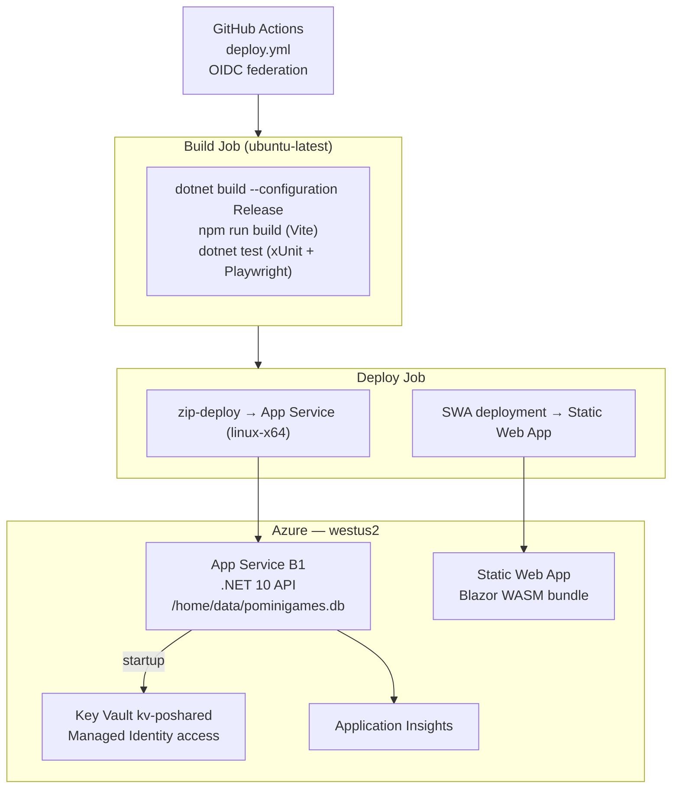

# PoMiniGames — Project Architecture Blueprint

> Generated: 2026-04-27  
> Technology: .NET 10 + Blazor WebAssembly  
> Pattern: Onion (Clean) Architecture  
> Detail level: Comprehensive / Implementation-Ready

---

## 1. Architecture Detection and Analysis

### Technology Stack

| Layer | Technology | Evidence |
|---|---|---|
| Backend host | .NET 10 Minimal API | `src/PoMiniGames/PoMiniGames/PoMiniGames.csproj` |
| Frontend | Blazor WebAssembly | `src/PoMiniGames.Client/PoMiniGamesClient.csproj` |
| Real-time | SignalR WebSockets | `docs/Architecture_MASTER.mmd` — LobbyHub, MultiplayerHub |
| Storage | SQLite (Microsoft.Data.Sqlite) | `src/PoMiniGames.Infrastructure/Services/StorageService.cs` |
| Auth | Microsoft MSAL — OAuth2 JWT Bearer | `src/PoShared/Identity/PoMiniGamesIdentity.cs`, `SystemFlow_MASTER.mmd` |
| Logging | Serilog → App Insights | `docs/Architecture_MASTER.mmd` |
| Telemetry | OpenTelemetry OTLP | `docs/Architecture_MASTER.mmd` |
| Secrets | Azure Key Vault (Managed Identity) | `docs/Architecture_MASTER.mmd` |
| IaC | Azure Bicep + `azd` | `infra/`, `azure.yaml` |
| UI components | Radzen | `src/PoMiniGames.Client/Program.cs` |
| CI/CD | GitHub Actions (OIDC federation) | `.github/workflows/deploy.yml` |

### Architectural Pattern

**Onion (Clean) Architecture** with four project rings:

```
Domain (innermost, no external dependencies)
  └── Application (depends on Domain only)
        └── Infrastructure (depends on Application)
              └── Host / API (depends on all rings + wires DI)
```

The Blazor WebAssembly client is a separate deployable that communicates only via HTTP/WebSocket APIs — it has no direct dependency on any server ring.

---

## 2. Architectural Overview

PoMiniGames is an **instant-play mini-games platform** delivered as two independently deployable artifacts:

| Artifact | Runtime | Host |
|---|---|---|
| `.NET 10 API` | App Service Linux B1 | REST + SignalR WebSockets |
| `Blazor WASM client` | Azure Static Web App / CDN | Static files, browser-side C# |

**Guiding principles:**

1. **Dependency inversion** — outer rings depend on inner; inner rings define interfaces (`IStorageService`, `IDiagnosticsSnapshotProvider`).
2. **Offline resilience** — every game runs without API connectivity; server calls are best-effort.
3. **Deterministic domain logic** — `EloCalculator` is pure (no I/O), recomputable from W/L/D counts alone.
4. **Security at boundaries** — JWT validation happens in the API; the WASM client is untrusted.
5. **Observability by default** — every significant operation emits a trace via OpenTelemetry.

---

## 3. Architecture Visualization

### 3.1 System Context (C4 L1)



### 3.2 Container Diagram (C4 L2)



### 3.3 Onion Layer Dependency Flow

```
PoMiniGames.Domain
  Models/PlayerStats.cs
  Models/PoDropSquareHighScore.cs
  Models/SnakeHighScore.cs
  Services/EloCalculator.cs          ← pure logic, no I/O
  Services/EloOptions.cs

        ↑ referenced by

PoMiniGames.Application
  DTOs/PlayerStatsDto.cs
  Services/IStorageService.cs        ← storage contract
  Diagnostics/IDiagnosticsSnapshotProvider.cs

        ↑ implemented by

PoMiniGames.Infrastructure
  Services/StorageService.cs         ← SQLite implementation
  Services/DbInitializer.cs          ← schema bootstrap
  HealthChecks/StorageHealthCheck.cs
  HealthChecks/AzureTableStorageHealthCheck.cs

        ↑ composed by

PoMiniGames (Host)
  Program.cs / Startup                ← DI wiring, middleware pipeline
  Endpoints/*                         ← Minimal API route handlers
```

---

## 4. Core Architectural Components

### 4.1 `PoMiniGames.Domain`

**Purpose:** Inner-most ring. Contains all business entities and pure domain logic. Has zero references to I/O, ASP.NET, or Entity Framework.

| File | Role |
|---|---|
| `Models/PlayerStats.cs` | Aggregate root — per-player, per-difficulty W/L/D/ELO |
| `Models/SnakeHighScore.cs` | Value object — top-score record |
| `Models/PoDropSquareHighScore.cs` | Value object — survival time record |
| `Services/EloCalculator.cs` | Domain service — deterministic ELO computation |
| `Services/EloOptions.cs` | Configuration value object — AI virtual ratings, K-factor |

**Key design decision:** `EloCalculator.ApplyAll()` is **stateless and idempotent** — ELO is always recomputed from accumulated W/L/D counts, never incrementally updated. This makes backfilling legacy records safe.

**Dependency rules:** References only `PoMiniGames.Domain` itself. No NuGet packages beyond BCL.

---

### 4.2 `PoMiniGames.Application`

**Purpose:** Application ring. Defines contracts (interfaces and DTOs) that the infrastructure and host rings implement or consume.

| File | Role |
|---|---|
| `Services/IStorageService.cs` | Storage abstraction — typed CRUD for all persistence needs |
| `DTOs/PlayerStatsDto.cs` | Read-model DTO for API responses |
| `Diagnostics/IDiagnosticsSnapshotProvider.cs` | Diagnostics contract — async snapshot for `/diag` endpoint |

**Dependency rules:** References `PoMiniGames.Domain` only. No infrastructure packages.

---

### 4.3 `PoMiniGames.Infrastructure`

**Purpose:** Adapters and external service wrappers. Implements contracts defined in Application.

| File | Role |
|---|---|
| `Services/StorageService.cs` | SQLite implementation of `IStorageService` |
| `Services/DbInitializer.cs` | Schema bootstrap — creates tables + indexes at startup |
| `HealthChecks/StorageHealthCheck.cs` | ASP.NET health check — probes SQLite read path |
| `HealthChecks/AzureTableStorageHealthCheck.cs` | Optional Azure Table Storage probe (Azurite in CI) |

**SQLite schema managed in-process:**

```sql
-- PlayerStats: JSON column strategy for flexible stats shape
CREATE TABLE PlayerStats (
    Game        TEXT NOT NULL,
    PlayerName  TEXT NOT NULL,
    StatsJson   TEXT NOT NULL,  -- DifficultyStats for Easy/Medium/Hard
    PRIMARY KEY (Game, PlayerName)
);

-- JSON-extraction indexes for leaderboard sorts (SQLite ≥ 3.38)
CREATE INDEX idx_ps_game_easy_elo ON PlayerStats(Game, json_extract(StatsJson, '$.Easy.EloRating') DESC);
```

**WAL mode** enabled at startup for concurrent read/write without blocking.

**Dependency rules:** References `PoMiniGames.Application` and `PoMiniGames.Domain`. References `Microsoft.Data.Sqlite`, `Azure.Data.Tables`, `Azure.Identity`.

---

### 4.4 `PoMiniGames` (Host)

**Purpose:** Composition root. Wires DI, configures middleware pipeline, registers Minimal API endpoints, and hosts SignalR hubs.

**Key responsibilities:**
- `builder.Services.AddSingleton<EloCalculator>()`
- `builder.Services.AddSingleton<IStorageService, StorageService>()`
- `builder.Services.AddAuthentication().AddJwtBearer(...)` — MSAL JWT validation
- `app.MapHub<LobbyHub>("/api/hubs/lobby")`
- `app.MapHub<MultiplayerHub>("/api/hubs/multiplayer")`
- Startup call to `StorageService.Initialize()` → `DbInitializer.InitializeSchema()`

**Endpoints (Minimal API pattern):**

| Route | Purpose |
|---|---|
| `GET /api/health/ping` | Liveness probe |
| `GET /api/health` | Full health with SQLite + optional Azure Storage checks |
| `GET /api/auth/config` | Pushes MSAL config to client (client ID, tenant, etc.) |
| `POST /api/auth/dev-login` | DevCookie bypass for local dev (disabled in prod) |
| `GET /api/auth/me` | Returns authenticated user profile from JWT claims |
| `PUT /api/{game}/players/{name}/stats` | Upsert player stats (authenticated) |
| `GET /api/{game}/statistics/leaderboard` | Top-N leaderboard query |
| `GET /api/snake/highscores` | Snake high scores |
| `POST /api/snake/highscores` | Submit snake high score |
| `GET /api/podropsquare/highscores` | PoDropSquare high scores |
| `POST /api/podropsquare/highscores` | Submit PoDropSquare high score |
| `POST /api/multiplayer/queue` | Enqueue for matchmaking |
| `GET /diag` | Diagnostics snapshot (dev only) |

---

### 4.5 `PoMiniGames.Client` (Blazor WASM)

**Purpose:** Browser-side Blazor WebAssembly SPA. Runs entirely in the browser after the initial load.

**Page routing:**

| Page | Route | Description |
|---|---|---|
| `Index.razor` | `/` | Home — game grid, top scores |
| `SinglePlayerPage.razor` | `/singleplayer` | Game picker for AI matches |
| `OnlineMultiplayerPage.razor` | `/multiplayer` | 2P lobby + live game |
| `MultiPlayerSelectPage.razor` | `/multiplayer/select` | Game mode picker |
| `AuthCallbackPage.razor` | `/auth-callback` | MSAL OAuth2 redirect handler |
| `DiagPage.razor` | `/diag` | Frontend diagnostics view |

**Client services (scoped DI):**

| Service | Responsibility |
|---|---|
| `ApiService` | All HTTP calls to the backend API (5 s timeout, typed JSON) |
| `AuthStateService` | MSAL state machine — config fetch → PKCE popup → session persist |
| `GameStatsService` | Local game result aggregation + API sync |
| `PlayerNameService` | Persistent player name storage (browser localStorage) |
| `ToastService` | UI notification bus |

**Game modules (self-contained C# logic):**

| Module | AI | Board Type |
|---|---|---|
| `TicTacToe` | Minimax + transposition table (depth 4) | 3×3 grid |
| `ConnectFive` | Heuristic board scoring | 15×15 grid |
| `SnakeGame` | — | Canvas/JS-interop |
| `PoRunner` | — | Side-scroller state machine |

**AI difficulty strategy (TicTacToe / ConnectFive):**

```
Easy   → 30% block chance + random move
Medium → Win > Block > Center > Random
Hard   → Full minimax with transposition table (depth 4)
```

---

### 4.6 `PoShared`

**Purpose:** Cross-cutting infrastructure helpers shared between the API host and any future services.

| File | Role |
|---|---|
| `Identity/PoMiniGamesIdentity.cs` | Canonical constants (ports 5000/5001, app prefix) |
| `Diagnostics/SecretMasker.cs` | Masks secrets before they reach logs |

---

## 5. Architectural Layers and Dependencies

```
Layer               Allowed outward dependencies
─────────────────────────────────────────────────
Domain              None (BCL only)
Application         Domain
Infrastructure      Application + Domain + Azure SDKs + Microsoft.Data.Sqlite
Host                Infrastructure + Application + Domain + ASP.NET + SignalR
Client (WASM)       BCL + Radzen + Microsoft.AspNetCore.Components.WebAssembly
PoShared            BCL only
```

**Dependency injection lifetime rules:**

| Service | Lifetime | Reason |
|---|---|---|
| `EloCalculator` | Singleton | Stateless pure computation |
| `EloOptions` | Singleton | Config value object |
| `StorageService` | Singleton | SQLite connection pool owned here |
| `DbInitializer` | Called once at startup | Schema idempotent |
| `StorageHealthCheck` | Transient (health framework manages) | Per-check probe |

---

## 6. Data Architecture

### 6.1 Domain Model

```
PlayerStats (aggregate)
  ├── Easy   : DifficultyStats { Wins, Losses, Draws, TotalGames, WinStreak, EloRating }
  ├── Medium : DifficultyStats
  └── Hard   : DifficultyStats
  PlayerId, PlayerName, CreatedAt, UpdatedAt
  (TotalWins, TotalLosses, TotalDraws, WinRate — computed properties, not stored)

SnakeHighScore     { Initials, Score, Date, GameDuration, SnakeLength, FoodEaten }
PoDropSquareHighScore { PlayerInitials, SurvivalTime, Date, PlayerName? }
```

### 6.2 Persistence Strategy

**JSON column pattern** — `PlayerStats` is stored with a `StatsJson TEXT` column holding the serialized `PlayerStats` object. JSON-extraction indexes via `json_extract()` enable efficient leaderboard sorts without a columnar schema migration per new game.

**No ORM** — raw `SqliteCommand` / `SqliteDataReader` with manual mapping. Keeps startup fast and avoids EF migration overhead for a single-file DB.

### 6.3 Entity Relationships

```
PlayerStats ──(PK: Game, PlayerName)──> DifficultyStats (embedded in StatsJson)
SnakeHighScores ──(PK: Id AUTOINCREMENT)
PoDropSquareHighScores ──(PK: Id AUTOINCREMENT)
MultiplayerMatch ──(PK: MatchId GUID)──> LobbyPlayer (MatchId FK)
```

### 6.4 Data Flow (Stats Save)

```
Client.GameStatsService.SaveResultAsync()
  → PUT /api/{game}/players/{name}/stats  [Bearer JWT]
  → StorageService.SavePlayerStatsAsync()
      → EloCalculator.ApplyAll(stats)   ← domain logic applied before persist
      → UPSERT INTO PlayerStats (Game, PlayerName, StatsJson, UpdatedAt)
```

---

## 7. Cross-Cutting Concerns

### 7.1 Authentication & Authorization

| Concern | Implementation |
|---|---|
| Auth provider | Microsoft Identity Platform (OAuth2 PKCE) |
| Token format | JWT Bearer — audience, issuer, signature validated |
| Token TTL | 12 hours |
| Client-side | `AuthStateService` manages MSAL state machine |
| Dev bypass | `POST /api/auth/dev-login` + DevCookie — disabled in production via config flag |
| WASM token pass-through | `?access_token=JWT` on SignalR WebSocket connection |

**Access matrix (from `docs/AccessControl_MATRIX.mmd`):**

| Endpoint group | Anonymous | Authenticated | Host |
|---|---|---|---|
| Health, ping | ✓ | ✓ | ✓ |
| Auth config | ✓ | ✓ | ✓ |
| Leaderboard reads | ✓ | ✓ | ✓ |
| Stats write (upsert) | ✗ | ✓ | ✓ |
| Multiplayer queue | ✗ | ✓ | ✓ |
| Lobby StartGame | ✗ | ✗ | ✓ |
| /diag endpoint | Dev only | Dev only | Dev only |

### 7.2 Error Handling & Resilience

- API returns RFC 7807 `ProblemDetails` on validation errors (via `AddProblemDetails()`)
- `ApiService` (client) catches all exceptions and returns `null` — callers handle absence
- Offline resilience: each game module stores state locally; API sync is fire-and-forget
- `StorageHealthCheck` surfaces DB failures to the `/api/health` endpoint

### 7.3 Logging & Observability

| Signal | Sink | Implementation |
|---|---|---|
| Structured logs | File + Console + App Insights | Serilog |
| Distributed traces | Azure Application Insights (OTLP) | OpenTelemetry SDK |
| Secret masking | Before any log emission | `PoShared/Diagnostics/SecretMasker.cs` |
| Diagnostics snapshot | `/diag` page (dev) | `IDiagnosticsSnapshotProvider` |

### 7.4 Input Validation & Sanitization

- Player names are sanitized server-side by rejecting chars in `StorageService._invalidChars`:
  ```csharp
  Path.GetInvalidFileNameChars() + { '\'', '"', ';', '\\', '/' }
  ```
- Route parameters typed in Minimal API route patterns (e.g., `{game:alpha}`)
- `PlayerStatsDto` uses `required init` properties — null-safe by construction

### 7.5 Configuration Management

| Config key | Source | Example |
|---|---|---|
| `Sqlite:DataDirectory` | `appsettings.json` / env | `/home/data` |
| `Sqlite:DatabaseFileName` | `appsettings.json` / env | `pominigames.db` |
| `PoMiniGames:MicrosoftAuth:ClientId` | Azure Key Vault (prod) / user-secrets (dev) | MSAL client ID |
| `PoMiniGames:MicrosoftAuth:ApiClientId` | Azure Key Vault (prod) / user-secrets (dev) | API audience |
| `ApplicationInsights:ConnectionString` | Azure Key Vault (prod) / env (dev) | OTLP connection string |

---

## 8. Service Communication Patterns

### 8.1 HTTP REST (Client → API)

- Base URL from `builder.HostEnvironment.BaseAddress` (WASM host-relative)
- All calls via `ApiService` — typed `HttpClient`, 5 s timeout, `System.Text.Json` camelCase
- Response: typed POCOs or `null` on error (never throws to the caller)

### 8.2 SignalR WebSockets (Client → Hubs)

| Hub | Route | Auth | Purpose |
|---|---|---|---|
| `LobbyHub` | `/api/hubs/lobby` | JWT query-string | Match formation, host management |
| `MultiplayerHub` | `/api/hubs/multiplayer` | JWT query-string | Real-time game input relay |

**Server-to-client events:**

| Event | Direction | Payload |
|---|---|---|
| `LobbyUpdated` | Server → all group | `{ isHost, players[] }` |
| `GameStarting` | Server → all group | `{ gameKey }` |
| `RealtimeInput` | Server → all group | `{ fromUserId, fromDisplayName, payload, sentAt }` |

### 8.3 Startup Secret Fetch (API → Key Vault)

Secrets are resolved at startup via `DefaultAzureCredential` (Managed Identity in Azure, developer credential locally). They are injected into `IConfiguration` — application code reads configuration, never the Key Vault SDK directly.

---

## 9. .NET-Specific Architectural Patterns

### Minimal API Pattern

```csharp
// Route grouping
var ttt = app.MapGroup("/api/tictactoe").WithTags("TicTacToe");

// Typed results + OpenAPI metadata
ttt.MapGet("/statistics/leaderboard", async (IStorageService storage, ...) =>
{
    var entries = await storage.GetLeaderboardAsync("tictactoe", limit);
    return TypedResults.Ok(entries);
})
.WithName("GetTicTacToeLeaderboard")
.WithSummary("Returns the top-N leaderboard for TicTacToe")
.RequireAuthorization();
```

### Dependency Injection Container Configuration

```csharp
// Domain
builder.Services.AddSingleton(EloOptions.Default);
builder.Services.AddSingleton<EloCalculator>();

// Infrastructure
builder.Services.AddSingleton<IStorageService, StorageService>();

// Health checks
builder.Services.AddHealthChecks()
    .AddCheck<StorageHealthCheck>("storage")
    .AddCheck<AzureTableStorageHealthCheck>("azure-table-storage");
```

### WebAssembly Service Registration

```csharp
// Scoped services in WASM = new instance per navigation/component tree
builder.Services.AddScoped<ApiService>();
builder.Services.AddScoped<AuthStateService>();
builder.Services.AddScoped<GameStatsService>();
builder.Services.AddScoped<PlayerNameService>();
builder.Services.AddScoped<ToastService>();
builder.Services.AddRadzenComponents();
```

---

## 10. Testing Architecture

| Layer | Framework | Scope | Key files |
|---|---|---|---|
| Unit | xUnit | Domain logic (EloCalculator) | `tests/UnitTests/EloCalculatorTests.cs` |
| Unit | xUnit | Identity helpers | `tests/UnitTests/PrefixKeyVaultSecretManagerTests.cs` |
| Integration | xUnit + `WebApplicationFactory` | Full API stack with in-memory/SQLite | `tests/IntegrationTests/` |
| Integration | Testcontainers (Azurite) | Azure Table Storage health check | `AzuriteHealthIntegrationTests.cs` |
| E2E-API | xUnit + `WebApplicationFactory` | Pure HTTP-contract smoke | `tests/E2EAPI/` |
| E2E-UI | Playwright (C#) | Real browser on a Kestrel port | `tests/E2EUI/` |

**Integration test factories:**
- `TestWebApplicationFactory` — standard WebApplicationFactory wiring
- `LocalAuthWebApplicationFactory` — injects `TestAuthHandler` to bypass MSAL for test runs

**E2E spec coverage:**

| Spec | Coverage |
|---|---|
| `api-contract.spec.js` | All REST endpoint contracts |
| `tictactoe.spec.js` | AI game flow |
| `connectfive.spec.js` | Win detection |
| `posnakegame.spec.js` | High score submission |
| `pofight.spec.js` | Fight game loop |
| `dev-bypass-identity.spec.js` | DevCookie auth flow |
| `error-scenarios.spec.js` | 4xx/5xx resilience |
| `offline-resilience.spec.js` | API unavailable paths |

---

## 11. Deployment Architecture



**Environment configuration:**

| Environment | DB location | Auth | Key Vault |
|---|---|---|---|
| Local dev | `AppContext.BaseDirectory/data` | DevCookie bypass | `dotnet user-secrets` |
| Azure prod | `/home/data/pominigames.db` | MSAL JWT | Managed Identity |
| CI (GitHub Actions) | In-process SQLite (temp) | `TestAuthHandler` | N/A |

---

## 12. Extension and Evolution Patterns

### Adding a New Game with Leaderboard

1. **Domain** — Add a model in `PoMiniGames.Domain/Models/` if the high-score shape differs.
2. **Application** — Add method signature to `IStorageService` (e.g., `GetNewGameHighScoresAsync`).
3. **Infrastructure** — Implement in `StorageService.cs`; add `CREATE TABLE` to `DbInitializer.cs`.
4. **Host** — Add endpoint group via `app.MapGroup("/api/newgame")`.
5. **Client** — Add game module folder under `src/PoMiniGames.Client/Games/NewGame/`.

### Adding a New Game with AI

1. Implement game board logic in `Games/NewGame/NewGameBoard.cs`.
2. Implement AI in `Games/NewGame/NewGameAI.cs` — follow the `GetMove(board, player, difficulty)` pattern.
3. Register difficulty levels in `Enums/GameEnums.cs`.
4. Wire into `SinglePlayerPage.razor` via the existing `GameShell` component.

### Extending ELO Logic

- Add new AI virtual ratings to `EloOptions.cs`.
- `EloCalculator.ApplyAll()` is fully deterministic — backfilling is always safe.

### Adding a New API Feature

Follow the existing Minimal API pattern:
```csharp
var group = app.MapGroup("/api/mygame").WithTags("MyGame");

group.MapPost("/highscores", async (MyScoreDto dto, IStorageService storage) =>
{
    var saved = await storage.SaveMyHighScoreAsync(dto);
    return TypedResults.Created($"/api/mygame/highscores/{saved.Id}", saved);
})
.WithName("SubmitMyHighScore")
.WithSummary("Submit a high score for MyGame");
```

---

## 13. Architectural Decision Records

### ADR-001: JSON Column Storage for PlayerStats

**Context:** PlayerStats has a nested `DifficultyStats` per tier (Easy/Medium/Hard). A normalized relational model would require 3 rows per player per game, complicating queries.

**Decision:** Store the entire `PlayerStats` object as a `StatsJson TEXT` column. Use `json_extract()` SQLite function for indexed sorts on ELO and win rate.

**Consequences:**
- (+) Schema changes to `DifficultyStats` don't require SQL migrations.
- (+) Leaderboard queries remain single-table, single-pass.
- (−) Stats can't be queried ad-hoc with SQL JOINs; all shape changes require code.

---

### ADR-002: Deterministic ELO (No Incremental Updates)

**Context:** ELO ratings are typically updated incrementally after each match. This creates a path-dependency problem when backfilling or auditing legacy records.

**Decision:** Compute ELO from W/L/D aggregate counts using fixed AI virtual ratings (Easy=800, Medium=1200, Hard=1600) and a fixed player reference ELO (1000). `EloCalculator` is always called before each `UPSERT`.

**Consequences:**
- (+) Fully idempotent — same inputs always yield same ELO.
- (+) Old records can be backfilled without losing rating history.
- (−) Doesn't reward improving over time within a difficulty tier (intentional for this use case).

---

### ADR-003: Blazor WebAssembly over React

**Context:** README mentions React 18 in the tech stack, but the actual deployed client (`PoMiniGames.Client`) is Blazor WebAssembly.

**Decision:** Blazor WASM was adopted to share C# types (models, game board logic) between server and client without a separate TS type generation step.

**Consequences:**
- (+) Shared C# game logic (TicTacToeBoard, ConnectFiveBoard) runs identically on client and server.
- (+) Single language across the full stack.
- (−) Larger initial download size vs. a JS bundle.
- (−) README tech-stack table still references React 18 — should be updated.

---

### ADR-004: No ORM

**Context:** The schema is small (3 tables + transient SignalR state). Using EF Core would add significant startup time and migration tooling overhead.

**Decision:** Use raw `SqliteCommand`/`SqliteDataReader` with manual JSON serialization.

**Consequences:**
- (+) Sub-millisecond startup, minimal binary size.
- (+) Full control over SQL, including `PRAGMA journal_mode=WAL`.
- (−) No LINQ query composability — new query shapes require new SQL strings.

---

## 14. Architecture Governance

**Layer boundary enforcement:** Currently convention-based via project reference constraints in `.csproj` files. No automated Roslyn analyzer or ArchUnitNET check is in place.

**Recommended automated check:**
```xml
<!-- In PoMiniGames.Domain.csproj — enforce no external package refs -->
<ItemGroup Condition="'$(Configuration)' == 'Debug'">
  <!-- Add ArchUnitNET or NDepend reference here -->
</ItemGroup>
```

**Documentation practices:** All architectural diagrams are Mermaid `.mmd` files in `/docs`. The blueprint (this file) should be regenerated whenever a new layer boundary or persistence pattern is introduced.

---

## 15. Blueprint for New Development

### Starting Points by Feature Type

| Feature | Start here |
|---|---|
| New game (offline only) | `src/PoMiniGames.Client/Games/NewGame/` |
| New game with leaderboard | Domain model → IStorageService → StorageService → endpoint → client service |
| New API endpoint | `src/PoMiniGames/PoMiniGames/` — add to existing `MapGroup` |
| New domain rule | `src/PoMiniGames.Domain/Services/` — pure method, no I/O |
| New health check | `src/PoMiniGames.Infrastructure/HealthChecks/` |
| New client page | `src/PoMiniGames.Client/Pages/` — add route in `App.razor` |

### Development Workflow

```bash
# 1. Build server
dotnet build src/PoMiniGames/PoMiniGames/PoMiniGames.csproj

# 2. Unit tests
dotnet test tests/UnitTests/UnitTests.csproj -v minimal

# 3. Integration tests
dotnet test tests/IntegrationTests/IntegrationTests.csproj -v minimal

# 4. E2E API tests
dotnet test tests/E2EAPI/E2EAPI.csproj -v minimal

# 5. E2E UI tests
dotnet test tests/E2EUI/E2EUI.csproj -v minimal

# 4. Run API locally (port 5000)
dotnet run --project src/PoMiniGames/PoMiniGames/PoMiniGames.csproj

# 5. Run Blazor client
dotnet run --project src/PoMiniGames.Client/PoMiniGamesClient.csproj
```

### Common Pitfalls

| Pitfall | Prevention |
|---|---|
| Referencing `IStorageService` from Domain | Domain must not reference Application or Infrastructure |
| Calling `EloCalculator` before `UPSERT` | Always call `eloCalc.ApplyAll(stats)` inside `SavePlayerStatsAsync` |
| Storing secrets in `appsettings.json` | Use `dotnet user-secrets` locally, Key Vault in prod |
| Blocking SignalR hub methods | All hub methods must be `async Task` |
| Returning `Results` instead of `TypedResults` | Use `TypedResults.*` for OpenAPI schema inference |
| Client calling API directly from game modules | Route through `ApiService` and `GameStatsService` only |

---

*Blueprint generated from source analysis of commit state on 2026-04-27. Regenerate after major architectural changes.*
