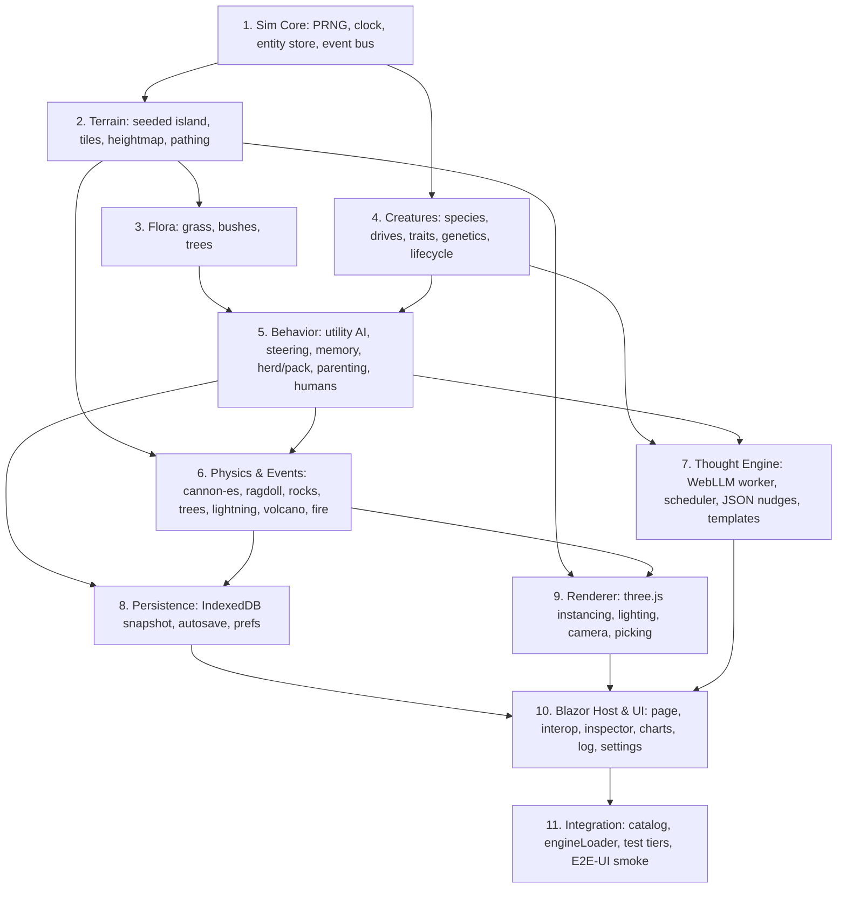

# Capability Map — PoEcosystem

PoEcosystem decomposes into 11 independently testable modules. Arrows are build-order
dependencies (a module may be built only after everything pointing at it exists).

## Modules

| # | Module | Location (`wwwroot/js/poecosystem/` unless noted) | Test surface | Depends on |
|---|--------|------------------------------------------------------|--------------|------------|
| 1 | **Sim Core** | `sim/core/{prng,clock,entities,events,config}.js` | Vitest: determinism of seeded PRNG; fixed-step accumulator; SoA entity alloc/free; event bus ordering | — |
| 2 | **Terrain** | `sim/terrain/{noise,island,tiles,pathing}.js` | Vitest: ocean border invariant; ≥1 lake, ≥1 volcano; walkable ratio bounds; same seed ⇒ identical map; flow-field reaches all walkable tiles | 1 |
| 3 | **Flora** | `sim/flora/{grass,bushes,trees}.js` | Vitest: grass regrowth curve; berry ripening; tree health/burn; density caps per biome | 2 |
| 4 | **Creatures** | `sim/creatures/{species,drives,traits,genetics,names,lifecycle}.js` | Vitest: hunger/thirst/age integration; death causes; life-stage transitions; mating eligibility; trait blending + mutation clamp; name uniqueness | 1 |
| 5 | **Behavior** | `sim/behavior/{utility,steering,memory,social,humans}.js` | Vitest: utility picks highest scored goal; flee wins over eat under threat; herd cohesion math; memory decay; pack share-kill; hut build triggers when beds < tribe | 3, 4 |
| 6 | **Physics & Events** | `sim/physics/{world,ragdoll,rocks,fallingTree,explosion}.js`, `sim/events/{scheduler,lightning,rockslide,volcano,fire}.js` | Vitest (cannon-es runs in Node): ragdoll settles < 10 s; felled tree comes to rest; rock rolls downhill on heightfield; explosion impulse ∝ 1/r; fire spreads only to flammable tiles and dies at water; event scheduler respects min spacing | 2, 5 |
| 7 | **Thought Engine** | `sim/thoughts/{scheduler,prompt,nudges,templates}.js`, `thoughtWorker.js`, `thoughtBridge.js` | Vitest: round-robin covers every creature before repeating; selected creature preempts; delta clamped to ±0.25 and decays to 0 in 60 s; malformed JSON ⇒ template fallback; prompt ≤ 600 chars | 4, 5 |
| 8 | **Persistence** | `sim/persistence/{snapshot,idb,prefs}.js` | Vitest: snapshot→restore round-trip yields identical next-tick state; version mismatch ⇒ discard; in-memory IDB adapter | 5, 6 |
| 9 | **Renderer** | `render/{renderer,terrainMesh,creatureMeshes,floraMeshes,propMeshes,lighting,camera,picking}.js` | Not unit-tested (WebGL); covered by E2E-UI smoke + manual checklist | 2, 6 |
| 10 | **Blazor Host & UI** | `src/PoMiniGames.Client/Games/PoEcosystem/**` | E2E-UI smoke; `dotnet build` (TreatWarningsAsErrors + trim analyzer) | 7, 8, 9 |
| 11 | **Integration** | `GameKey.cs` ×2, `GameCatalog.cs`, `engineLoader.js`, `package.json`, `vitest.config.js`, `scripts/test-all.ps1`, `tests/PoMiniGames.E2EUI/PoEcosystemUiTests.cs` | E2E-UI test passes; `pwsh scripts/test-all.ps1` shows the new `SimJs` tier | 10 |

## Build order

1 → 2 → 4 → 3 → 5 → 6 → 7 → 8 → 9 → 10 → 11

Modules 7 and 8 are independent of each other and of 9; they may be built in any order after 6.

## Cross-module contracts

- **`world.step(dtSeconds)` / `world.snapshot()`** (in `sim/world.js`) is the only surface the
  host uses. Everything under `sim/` is pure JS with no DOM, so it runs identically in Vitest,
  in the sim Web Worker, and (fallback) on the main thread.
- **Render frame** = one transferable `Float32Array` of `[x, y, z, yaw, scale, speciesId, stateId, lifeStage]`
  per visible entity, plus a separate array for physics props (ragdoll parts, rocks, logs,
  projectiles) as `[x, y, z, qx, qy, qz, qw, propKind]`.
- **Thought contract**: `{ thought: string≤120, trait: 'boldness'|'sociability'|'curiosity'|'greed'|'diligence', delta: number∈[-0.25,0.25] }`,
  enforced by JSON schema in WebLLM and re-validated in `nudges.js` before application.
- **Physics ownership**: living creatures are kinematic agents on the heightmap (no rigid body).
  A rigid body exists only for ragdolls, felled trees/logs, rocks, and volcanic projectiles.
