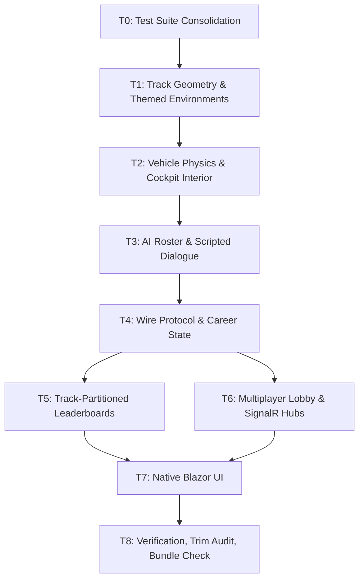

# Implementation Plan — PoCabinet (Cockpit-View Political Satire Racer)

## Architectural Decisions

### ADR-1: Server-Authoritative 3D Physics with three.js Render-Only Client
- **Context**: PoCabinet is cockpit-view, requiring a 3D scene that includes a cockpit interior (wheel, hood, gauges, mirror) and a 3D track ahead with AI cars visible in the distance. The framework already has server-authoritative simulation (PoRacer) and three.js scene graphs (PoEcosystem), but PoCabinet combines both for the first time.
- **Decision**: Keep physics + race state on the server in `PoCabinetSim.cs` (PoRacer pattern). The client is a thin three.js renderer that receives 30 Hz snapshots, mounts the cockpit + scene, and emits player intent. No physics runs in WASM.
- **Rationale**: Preserves anti-cheat (client cannot inject position claims), keeps multiplayer deterministic across machines, and reuses the proven PoRacer server-tick pattern. The cockpit interior is rendered locally because it's player-only chrome (no peer sees your dashboard) — purely cosmetic.

### ADR-2: Three Themed Tracks as Server Spline + Client Three.js Scene
- **Context**: Three distinct tracks (Capitol Speedway, Mar-a-Lago GP, Press Briefing 500) need different atmospheres (sky color, fog, lighting, ground material, side props). Track geometry is shared with peers; atmosphere can vary per client.
- **Decision**: Track splines and checkpoints live on the server (`PoCabinetTrackRegistry.cs`). The client `scene.js` switches the three.js scene's atmosphere when a new `TrackId` arrives in the snapshot, but the spline itself is published once and reused.
- **Rationale**: Deterministic physics require shared geometry. Atmosphere is a presentation concern that doesn't affect race fairness. Splitting this way keeps the wire snapshot small (TrackId is one enum value).

### ADR-3: 4 Distinct AI Personalities via CLR Heuristics
- **Context**: The framework already has 7 PoRacer AI personalities (look-ahead steering with tunable lateral offset, braking aggression, drafting affinity). PoCabinet needs 4 distinct officials that race distinctively enough that players can tell them apart at a glance.
- **Decision**: Reuse PoRacer's `PoRacerAiDriver` parameter structure (`LookaheadDistance`, `LateralOffset`, `BrakingAggression`, `CollisionTolerance`, `DraftingAffinity`). Define each official as a frozen struct of those parameters. Reuse PoRacer's look-ahead steering math; no new AI engine.
- **Rationale**: Code reuse over reinvention. The 4 officials share the same physics model as PoRacer's 7 bots; only their personality parameters differ. Distinctive racing comes from parameter choice, not from a new heuristic. Saves significant unit-test work too (existing PoRacer marshal-rescue + lap-completion tests can be adapted, not rewritten).

### ADR-4: Scripted Dialogue Pool, No AI Generation
- **Context**: Per the user's choice (no AI integration), all dialogue is hand-authored. There are 4 officials × ~26 lines each = ~104 lines total. Dialogue must fire at correct race events and not repeat too often.
- **Decision**: `PoCabinetDialogue.cs` defines per-official dictionaries keyed by `DialogueKind` (PreRace, PositionChange, LapFinish, RaceFinish). Selection is deterministic by `(officialId, raceTick)` seed so the same race always plays the same lines (testable). A `playedIndices` set prevents immediate repetition.
- **Rationale**: Hand-authored content is deterministic, content-policy-compliant, and zero-cost. Deterministic seed-based selection enables unit tests to assert "race tick N plays line X". The pool is large enough (~26 per official) that players won't notice repetition within a 3-lap race.

### ADR-5: Track-Partitioned Leaderboards + Demo Elo Table
- **Context**: Scores must be partitioned by track (3 tables, or 1 table with composite row keys) to avoid mixing lap times from tracks of different lengths. Demo mode needs an Elo ladder that commutes under concurrent demo finishes (PoBrawl pattern).
- **Decision**: Single `PoCabinetScores` table partitioned by `TrackId` (PoRacer pattern). Separate `PoCabinetElo` table for demo Elo; updates use `TableConcurrency.UpdateWithRetryAsync` with **increments**, never absolute-from-read (PoBrawl `PoBrawlFighterRatings` pattern). Two concurrent demo finishes compose; neither clobbers the other.
- **Rationale**: Same pattern proven across two existing games. Increments commute under ETag retries; absolutes do not.

### ADR-6: Native Blazor UI + Design Tokens, Zero Radzen
- **Context**: PoCabinet needs 4 UI surfaces (track selector, paint shop, championship view, lobby). The framework mandates zero Radzen per [`CLAUDE.md`](CLAUDE.md#L113). Bundle budget is 25 MB.
- **Decision**: Native Blazor `.razor` components with scoped CSS, reusing `wwwroot/css/app.css` design tokens (`--color-surface`, `--color-primary`, `--color-accent-gold` for the political theme, etc.). Components use semantic HTML for accessibility; no third-party UI library.
- **Rationale**: Matches framework convention. Keeps bundle small (zero added dependencies). Accessibility WCAG AA reachable with native Blazor + semantic markup.

### ADR-7: Blazored.LocalStorage for Career State (Player Device) + Optional Server Endpoint
- **Context**: Career progression (current stage, trophies, gold livery unlock) is local-first but should optionally sync cross-device for signed-in users.
- **Decision**: `PoCabinetCareerState.cs` wraps `ILocalStorageService` (Blazored.LocalStorage) for typed access to `currentStage`, `trophies`, `unlockedLiveries`. Optional `/api/pocabinet/career` POST endpoint syncs the same state to Azure Table Storage when signed in. Default behavior: local-only for guests, local+server for authed.
- **Rationale**: Blazored.LocalStorage is the framework's de facto localStorage wrapper (already used by other games). Server sync is optional — guests park progress locally without auth friction.

### ADR-8: Polly v8 Resilience for SignalR Reconnects + Transient HTTP
- **Context**: Multiplayer races need to survive brief network blips. SignalR's built-in reconnect is good but doesn't retry the initial `/negotiate` if the server is briefly unreachable.
- **Decision**: Configure `HttpClient` pipeline with Polly `AddPolicyHandler` for the lobby hub connection. Retry policy: 3 attempts, exponential backoff (250ms, 500ms, 1s), only on transient `HttpRequestException` or 5xx. No retry on 4xx (auth failures should surface immediately).
- **Rationale**: Adds resilience without masking real errors. Polly v8 syntax is cleaner than v7 (`ResiliencePipelineBuilder`); aligns with .NET 10 idioms.

### ADR-9: Trim-Safe three.js Mount (Static Geometry Cache)
- **Context**: The publish step runs `PublishTrimmed=true` + `EnableTrimAnalyzer` (per [`CLAUDE.md`](CLAUDE.md)); any IL2xxx warning fails the CI build. three.js is reflection-heavy (`Mesh`/`Material` lookups by string), which can trip IL2xxx.
- **Decision**: Pre-allocate all `BufferGeometry` instances at module-load time in `scene.js`/`cockpit.js`/`cars.js` and stash them in a frozen `GEOMETRY` constant. No per-race geometry construction. No reflection-based dispatch. Material colors are passed as constants, not via string lookup. If a trim warning is unavoidable, add the symbol to `TrimmerRoots.xml` with a comment explaining why.
- **Rationale**: Avoids the trim analyzer's reflection-detection entirely. Cache-friendly for GC. Same approach as PoEcosystem's render modules.

---

## Dependency Graph



---

## Top 10 Implementation Examples (referenced in tasks/todo.md)

1. **three.js scene base** — `scene.js` mounts camera, lights, fog, themed environment per track.
2. **Cockpit interior** — `cockpit.js` builds steering wheel, hood, RPM gauge, speedometer, rear-view mirror; teardown fn for race-end.
3. **AI car procedural mesh** — `cars.js` flat-shaded body + wheels via `BufferGeometry`, tintable per official.
4. **Blazored.LocalStorage career wrapper** — `PoCabinetCareerState.cs` typed accessor for `currentStage`, `trophies`, `unlockedLiveries`.
5. **Polly SignalR retry pipeline** — `AddPolicyHandler` exponential backoff on transient `HttpRequestException`/5xx.
6. **Server tick snapshot** — `PoCabinetSim.cs` Tick with pooled buffers + SignalR broadcast.
7. **Race-event dialogue** — `PoCabinetDialogue.cs` keyed by `DialogueKind`, deterministic seed.
8. **Lobby with claim-derived seats** — `PoCabinetLobbyService.cs` 8-char join codes, claim-derived identity.
9. **Elo increment under ETag** — `PoCabinetEloService.cs` using `TableConcurrency.UpdateWithRetryAsync`.
10. **Trim-safe three.js mount** — static `BufferGeometry` cache, no reflection-based dispatch.

---

## Risk Table

| Risk | Likelihood | Impact | Mitigation |
|------|------------|--------|------------|
| **Unit tier ceiling trips** (currently at 100/100) | High | Tests fail to compile | T0 consolidates ~15 existing tests via theory parameterization. Each task's test manifest is reviewed against headroom. |
| **three.js bundle blowout** | Medium | Trim fails or exceeds 25 MB | Static `BufferGeometry` cache (ADR-9). TrimRoots.xml fallback with documented rationale. Bundle size measured in T8. |
| **Shader compile error on a track** | Medium | That track unrenderable | Graceful fallback to low-poly wireframe per §10. Visual audit in T1 before any race logic depends on the scene. |
| **Server tick desync** | Medium | Multiplayer race state diverges between clients | PoRacer's 30 Hz deterministic tick + ETag updates; PoCabinet reuses the same pattern. T8 includes a multiplayer smoke test (2 simulated clients racing the same seed). |
| **Open antiforgery 403 bug** (framework-level, all games) | High | Authed writes 403 | Use `AntiforgeryTestExtensions.ArmAntiforgeryAsync()` in tests. E2E-API tests use the page-issued `fetch()` workaround per local-dev-notes. |
| **AI personality overlap** (officials look the same) | Medium | Satirical flavor lost | T3 includes a "personality differentiation" test asserting ≥5° average heading delta between officials over a 3-lap race. |
| **3D cockpit camera clipping on collision** | Low | Visual glitch | Camera shake is subtle (0.15s); cockpit interior is rendered from a fixed offset that doesn't penetrate walls (T2 unit test asserts camera position never enters a wall volume). |
| **Blazored.LocalStorage not registered** | Low | Career state silently fails to persist | T4 includes a registration smoke test (`ILocalStorageService` resolves in DI). Falls back to in-memory state with a console warning if absent. |
| **Polly retry masks real auth errors** | Low | Auth 4xx gets retried, hides bug | Polly policy explicitly excludes 4xx; only 5xx + `HttpRequestException`. T6 includes a test asserting 401 is not retried. |
| **Dialogue pool exhaustion** | Low | All dialogue repeats | `playedIndices` set prevents immediate repeat; if pool is exhausted for a race, the system falls back to a generic "..." line. T3 unit test. |

---

## Checkpoints & Verification Gates

- **Checkpoint A (T0–T2)**: Foundation. Verify Unit ceiling free (T0), track geometry math (T1), physics tick + cockpit mount (T2) all pass.
- **Checkpoint B (T3–T4)**: AI + Protocol. Verify 4 officials race distinctively (T3), wire DTOs serialize cleanly (T4).
- **Checkpoint C (T5–T6)**: Persistence + Networking. Verify leaderboards partition correctly + ETag updates commute (T5), lobby + race hubs handle 8 players (T6).
- **Checkpoint D (T7–T8)**: UI + Verification. Verify all 4 routes render, race HUD reads correctly (T7); trim audit + bundle check + ceiling pass all green (T8).

Each checkpoint gates the next task. A failing checkpoint stops the build.

---

## Build & Execution Sequence

```
T0  Test Suite Consolidation (preflight)
   │
   ▼
T1  Track Geometry & Themed Environments
   │
   ▼
T2  Vehicle Physics & Cockpit Interior
   │
   ▼
T3  AI Roster & Scripted Dialogue
   │
   ▼
T4  Wire Protocol & Career State
   │
   ▼
T5  Track-Partitioned Leaderboards
   │
   ▼
T6  Multiplayer Lobby & SignalR Hubs
   │
   ▼
T7  Native Blazor UI
   │
   ▼
T8  Verification, Trim Audit, Bundle Check
```

Each task: Red → Green → Build → Verify (per the TDD discipline in `tasks/todo.md`). No skipping, no weakening tests, no mocking-away validation.