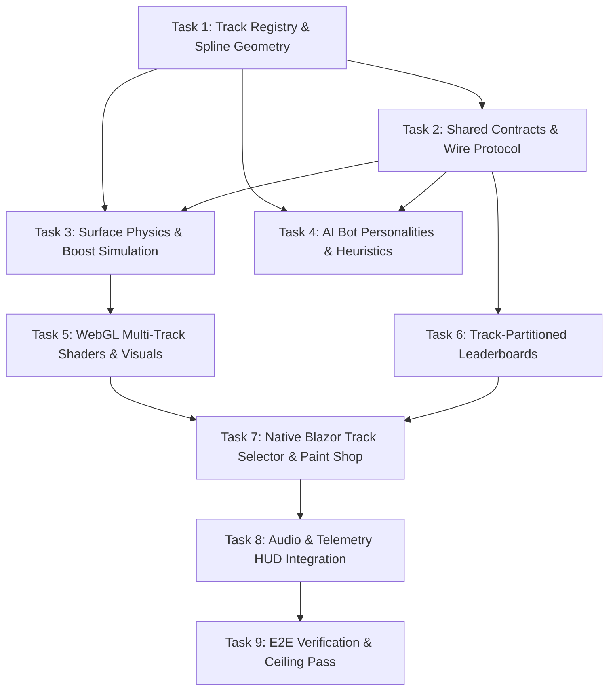

# Implementation Plan — PoRacer Overhaul (Multi-Track, AI Personalities & Physics)

## Architectural Decisions

### ADR-1: Server-Authoritative Multi-Track Simulation Engine
- **Context**: PoRacer previously ran on a single hardcoded track spline in `PoRacerSim.cs`. Adding multiple tracks requires dynamic spline sampling, wall normal calculation, surface detection, and boost pad boundaries.
- **Decision**: Create a dedicated `PoRacerTrackRegistry` and immutable `PoRacerTrackDefinition` domain models on the server. `PoRacerSim` is initialized with a selected `TrackId` (`circuit`, `neonskyline`, `desertdustway`).
- **Rationale**: Preserves server-authoritative integrity, prevents desyncs in multiplayer, and centralizes collision and track geometry in pure C# with 0 client drift.

### ADR-2: Surface Friction & Boost Vector Simulation
- **Context**: The game needs distinct driving feels on tarmac vs loose sand/dust, plus acceleration bursts over boost pads.
- **Decision**: Define track surface zones along spline segments and bounding polygons. Tarmac retains 1.0x grip; sand/dirt applies a 0.68x grip coefficient and accelerates slip angle calculations; boost pads apply a bounded acceleration scalar (1.35x) and set an active boost duration timer (1.8s) broadcast in the snapshot.
- **Rationale**: Provides satisfying arcade handling with clear risk/reward for cutting corners across dirt vs staying on the racing line or hitting boost pads.

### ADR-3: Heuristic AI Driver Personalities
- **Context**: Previously, all 7 bots used identical target-steering lookaheads with minor random skill offsets.
- **Decision**: Define 7 named AI driver profiles (*Apex Predator*, *Draft Hunter*, *Aggressive Bumper*, *Ghost Line*, *Speed Demon*, *Cautious Cruiser*, *Slipstreamer*) with distinct parameters: Lookahead Distance, Racing Line Lateral Offset (-0.8 to +0.8 track width), Braking Aggression, Collision Tolerance, and Drafting Affinity.
- **Rationale**: Creates lively, diverse race packs where some bots aggressively jostle and others take clean inside apex lines.

### ADR-4: Track-Partitioned Leaderboard Storage
- **Context**: High scores were previously recorded under a single unpartitioned table key, which would mix times from different tracks of varying lengths.
- **Decision**: Extend `PoRacerHighScore` with `TrackId`. In `StorageService.cs`, partition queries and storage rows by `TrackId` (e.g. `circuit`, `neonskyline`, `desertdustway`) while preserving backwards compatibility for legacy scores.
- **Rationale**: Ensures fair, track-accurate leaderboards without data corruption.

### ADR-5: Native Blazor UI & Zero Radzen
- **Context**: Need track selection cards, car paint customizer, and HUD meters while strictly maintaining the ~1.2 MB WASM bundle budget (`CLAUDE.md#L113`).
- **Decision**: Build `PoRacerTrackSelector.razor` and `PoRacerPaintShop.razor` using Native Blazor with existing design tokens (`--color-surface`, `--color-primary`, `--glass-bg`) and scoped CSS.
- **Rationale**: Delivers high polish and accessibility without adding 1 byte of third-party bundle bloat.

### ADR-6: Pure WebGL Canvas Theming & Shaders
- **Context**: 3 tracks need distinct environmental visuals (curbs, sky colors, road shaders, neon fences, desert dunes).
- **Decision**: Drive environmental palette and particle shaders in `poracerGl.js` using a clean theme descriptor received from `PoRacerStaticWorld.Theme`.
- **Rationale**: Eliminates large 3D asset downloads; keeps the client lean, fast-loading, and responsive on mobile.

---

## Dependency Graph

---

## Checkpoints & Verification Gates

- **Checkpoint A (Tasks 1–3)**: Core Math & Physics. Verify all 3 track splines, surface friction, boost timers, and wire serialization pass unit tests.
- **Checkpoint B (Tasks 4–6)**: AI & Persistence. Verify all 7 bot driver personalities complete laps reliably and track-specific leaderboards store and retrieve records cleanly.
- **Checkpoint C (Tasks 7–9)**: Presentation & Verification. Verify UI track selection, car paint customization, 60 FPS WebGL rendering across all 3 tracks, audio cues, and 100/50/25/25 test ceiling compliance.

---

## Risks and Mitigations

| Risk | Impact | Likelihood | Mitigation Strategy |
|---|---|---|---|
| **AI Stuck in Complex Hairpins** | High | Low | Monotonic progress watchdog: if progress stalls > 2.0s, marshal rescue advances bot 5 nodes along the racing line. |
| **WASM Bundle Size Exceeded** | High | Low | Strictly Native Blazor; zero Radzen; procedural canvas rendering; no heavy textures or 3D models. |
| **Snapshot Wire Bloat (> 20 Hz)** | Medium | Low | Maintain flat typed-array representation; send only active car states and delta events. |
| **Test Ceiling Overrun** | High | Low | Parameterize unit tests with `[Theory]` to test multiple tracks and bot profiles in single test methods. |
| **WebGL Context Loss on Track Change** | Medium | Low | Dispose existing track vertex buffers cleanly and rebind in-place without destroying the canvas context. |
