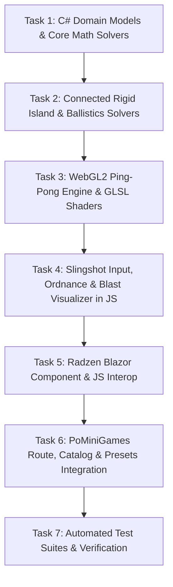

# Sand Implementation Plan

## 1. Architectural Decisions

### ADR-1: Hybrid WebGL2 Compute Pipeline + JavaScript Host Loop
- **Decision:** Execute cellular sub-stepping (2 to 4 passes per 16.6ms frame) using WebGL 2.0 ping-pong framebuffers (`FBO A <-> B`) with `RGBA32F` or `RGBA8` textures. Mouse drag input, slingshot trajectory tracing, and connected-component graph evaluation are computed in native JavaScript (`subsurface-engine.js`).
- **Rationale:** Processing 480,000 cells (800x600) at 60 FPS in CPU WASM incurs severe serialization and GC penalties. GPU cellular automata combined with lightweight JS rigid-body solvers guarantees a deterministic 60 FPS frame rate.

### ADR-2: Mohr-Coulomb Soil Modeling via Cellular Cohesion & Stress
- **Decision:** Each cell carries material identity, velocity vectors, and a Mohr-Coulomb cohesion/stress factor. Shear failure triggers granular avalanches when the critical unsupported span $L_{\text{crit}}$ is exceeded.
- **Rationale:** Gives natural, physical soil behavior (stable arches, trench vertical cuts, cave-in avalanches under excessive burden) without requiring full continuous finite-element computation.

### ADR-3: Connected-Component Rigid Island Solver for Concrete Bars
- **Decision:** A discrete graph connected-component solver runs on the concrete cell clusters. If all downward contacts (sand/bedrock) are excavated, the entire contiguous bar is treated as a single rigid island and translated downward until re-anchoring.
- **Rationale:** Ensures concrete bars don't dissolve or behave like loose sand; they preserve their structural rigidity.

### ADR-4: Eulerian Mass-Conserving Fluid with Lateral Drainage
- **Decision:** Water cells follow an Eulerian pressure-gradient flow model ($P = \rho g h$) with zero seepage through intact sand/concrete, dynamic breach flooding, and open drain boundaries at $X \le 0$ and $X \ge 799$.
- **Rationale:** Accurately models underground reservoirs, sudden dam-breaks, and prevents infinite fluid buildup on the canvas boundaries.

### ADR-5: Radzen Blazor UI Integration
- **Decision:** Use `Radzen.Blazor` controls for the docked toolbar: `RadzenSelectBar` for tools, `RadzenSlider` for brush size, `RadzenSwitch` for simulation state, `RadzenButton` for actions/presets, and `RadzenBadge` for live FPS and cell diagnostics.
- **Rationale:** Delivers a modern, rich, responsive UI adhering to the design requirements.

---

## 2. Dependency Graph

---

## 3. Risks & Mitigations

| Risk | Impact | Probability | Mitigation |
| --- | --- | --- | --- |
| WebGL2 float texture extensions missing on older mobile devices | High | Low | Support `RGBA8` integer packing fallback for cell material and velocity states. |
| High-frequency slingshot drag causing UI jank | Medium | Low | Run input handlers with passive event listeners directly on canvas in JS; update uniforms via RAF without WASM roundtrip. |
| Memory leaks on component teardown | Medium | Low | Implement full `IAsyncDisposable` in Blazor and dispose WebGL textures/buffers in JS. |
| Concrete bar solver performance during rapid excavation | Low | Medium | Throttle rigid island connectivity scans to active excavation regions and caching static anchored components. |

---

## 4. Checkpoints & Verification Milestones

- **Checkpoint 1 (Tasks 1–2):** Core domain models, Mohr-Coulomb equations, rigid island graph logic, and ballistics math pass 100% unit tests.
- **Checkpoint 2 (Tasks 3–4):** WebGL2 ping-pong shader simulation renders 800x600 grid, sand arching, fluid flow, rigid bar fall, and slingshot TNT/balloon ordnance at 60 FPS in browser.
- **Checkpoint 3 (Tasks 5–6):** Radzen Blazor UI controls seamlessly orchestrate tools, presets, pause/step, and integrate into PoMiniGames navigation.
- **Checkpoint 4 (Task 7):** Full test suite, bUnit component tests, lint/format, code-review, security-review, and simplification complete.
