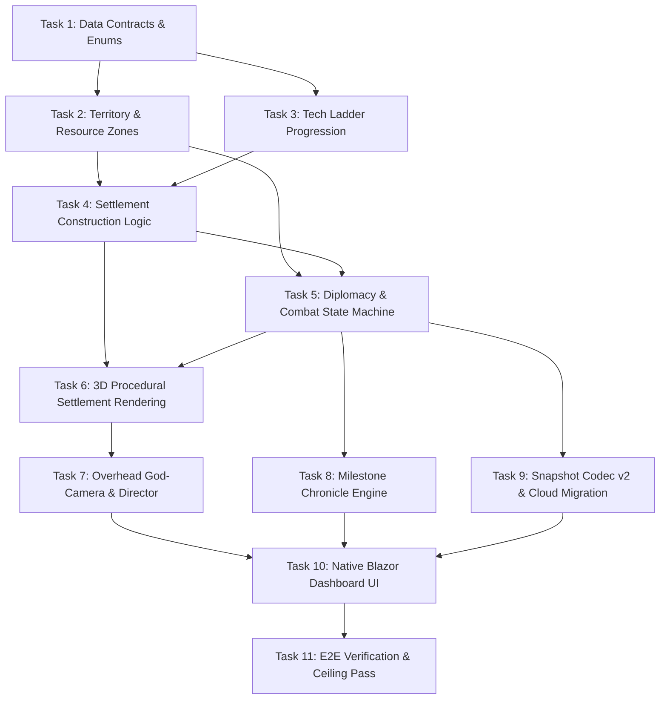

# Implementation Plan — PoEcosystem Civilization & Multi-Tribe Evolution

## Architectural Decisions

### ADR-1: Dedicated Web Worker Simulation Boundary
- **Context**: The multi-tribe simulation introduces territory Voronoi calculations, construction resource checks, dynamic diplomacy state transitions, and combat resolutions every tick.
- **Decision**: All tribal simulation modules (`sim/tribe/**`) execute entirely inside the existing simulation Web Worker (`simHost.js`).
- **Rationale**: Keeps the Blazor WASM / WebGL main thread free of CPU spikes, guaranteeing a smooth 60 FPS overhead render loop.

### ADR-2: Throttled Telemetry & Typed Transfer Frames
- **Context**: The native Blazor Analytics Dashboard needs real-time tribal metrics (populations, tech progress, resource stores, diplomatic states), while Three.js needs position/orientation matrices for rendering.
- **Decision**: Three.js receives high-frequency binary render frames (`Float32Array`) every frame (60 Hz). The Blazor interop bridge receives structured JSON telemetry at a throttled 2 Hz interval, plus immediate notifications for discrete milestone events (e.g. War Declared, Tech Unlocked).
- **Rationale**: Prevents JS-to-WASM interop overhead and JSON deserialization stalls on the client.

### ADR-3: High-Performance Analytics & Canvas Visualization
- **Context**: The user selected `Blazor.Extensions.Canvas` (#11), `LiveChartsCore.SkiaSharpView.Blazor` (#12), `Supercluster.KDTree` (#24), and requested recommended companion tools (`System.Threading.Channels` #5, `Stateless` #10, `System.Text.Json Source Generators` #34, `Blazored.Toast` #43, and `Bogus` #48).
- **Decision**: 
  1. Use `LiveChartsCore.SkiaSharpView.Blazor` for live population/resource trajectory charts.
  2. Use `Blazor.Extensions.Canvas` for the 2D strategic island minimap and dynamic territory influence contours.
  3. Use `Supercluster.KDTree` for rapid nearest-neighbor spatial queries.
  4. Use `System.Threading.Channels` (built-in BCL) for lock-free, backpressured telemetry queues.
  5. Use `Stateless` for deterministic tribal diplomacy and building construction lifecycle state machines.
  6. Use `System.Text.Json` Source Generators for trim-safe, zero-reflection serialization.
  7. Use `Blazored.Toast` for non-intrusive historical milestone popups.
  8. Use `Bogus` for deterministic test fixtures.
- **Rationale**: Keeps the codebase trim-safe, high-performance, and eliminates boilerplate while strictly excluding `Radzen.Blazor` per `CLAUDE.md#L113`.

### ADR-7: Spatial Indexing & Nearest-Neighbor Lookups via Supercluster.KDTree
- **Context**: Spatial checks (clustering tribe members, finding closest resource nodes, detecting encroaching hostiles) require efficient O(log N) queries.
- **Decision**: Utilize `Supercluster.KDTree` for spatial indexing of static resource depots, settlement totems, and cluster centers.
- **Rationale**: Eliminates brute-force O(N^2) pairwise distance checks and enables instant territorial voronoi partitioning.

### ADR-4: Snapshot Codec v2 with Backward Migration
- **Context**: Existing saves in IndexedDB and Azure Table Storage follow schema v1 (creatures, flora, terrain seed).
- **Decision**: Increment snapshot `schemaVersion` to 2. Serialize tribal entities, buildings, tech tiers, and diplomacy matrices. When reading v1 snapshots, automatically migrate by spawning 3 baseline tribes from existing human populations without throwing.
- **Rationale**: Prevents save corruption or crash on reload for existing users.

### ADR-5: Procedural Three.js Settlement Geometries
- **Context**: Visible 3D huts, granaries, watchtowers, and tribal banners are needed without introducing heavy GLB asset pipelines.
- **Decision**: Generate settlement structures procedurally using combined Three.js primitives (`CylinderGeometry`, `ConeGeometry`, `BoxGeometry`) and instanced rendering, colored with tribal palette tokens.
- **Rationale**: Zero network download footprint; immediate availability; high rendering throughput.

### ADR-6: Strict Solution Test Ceiling Budgeting
- **Context**: The solution enforces hard ceilings: Unit &le; 100, Integration &le; 50, E2E-API &le; 25, E2E-UI &le; 25 (`TierCeilingGuard.cs`).
- **Decision**: Keep JS simulation logic covered hermetically via Vitest (which does not consume xUnit method counts). In `tests/PoMiniGames.Unit`, add parameterized `[Theory]` tests for DTO mappings, migration rules, and chronicle formatting to consume &le; 3 test slots.
- **Rationale**: Ensures test coverage increases while ceiling guard tests pass unconditionally.

---

## Dependency Graph

---

## Checkpoints & Verification Gates

- **Checkpoint A (Tasks 1–3)**: Foundation & Territory. Validate that multiple tribes partition island territory, claim resources, and advance tech points via unit tests.
- **Checkpoint B (Tasks 4–6)**: Construction & 3D Visualization. Verify that autonomous humans harvest lumber/stone, build huts/granaries, and render 3D structures with tribal color accents.
- **Checkpoint C (Tasks 7–9)**: Diplomacy, Camera & Persistence. Verify overhead god-camera presets, diplomatic peace/war transitions, and v2 snapshot save/restore round-trips.
- **Checkpoint D (Tasks 10–11)**: Dashboard & Full Suite. Verify native Blazor dashboard interactivity, 0 compiler warnings, and all test ceilings green.

---

## Risks and Mitigations

| Risk | Impact | Likelihood | Mitigation Strategy |
|---|---|---|---|
| **WASM Bundle Bloat** | High | Low | Enforce native Blazor components and plain SVG. Zero heavy third-party UI packages (`CLAUDE.md#L113`). |
| **Worker Deserialization Lag** | Medium | Medium | Throttle dashboard telemetry to 2 Hz; send only delta changes for entity attributes; keep Three.js frames binary `Float32Array`. |
| **Test Ceiling Breach** | High | Low | Parameterize all new C# unit tests into existing theory slots; use Vitest for core JS sim tests. |
| **Tribal Extinction Snowball** | Medium | Medium | Implement minimum resilience reserves: defeated tribes can surrender or retreat, and wild humans can coalesce into a new tribe if one collapses. |
| **Camera Clipping / Terrain Occlusion** | Low | Low | God-camera computes heightfield collision raycasts to clamp altitude above hills and volcanic peaks. |

